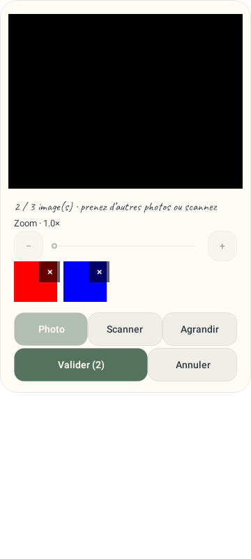
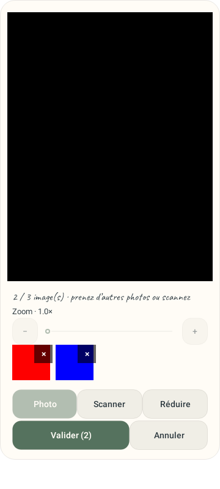
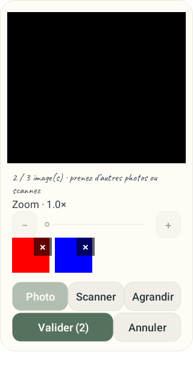
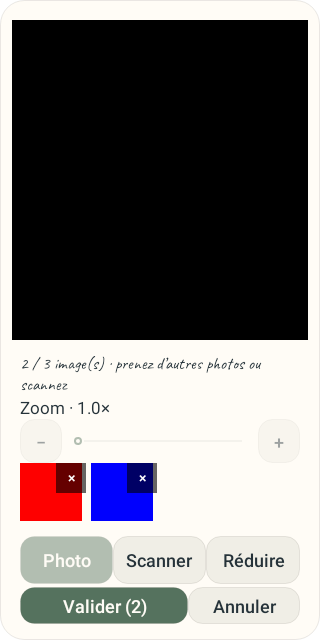
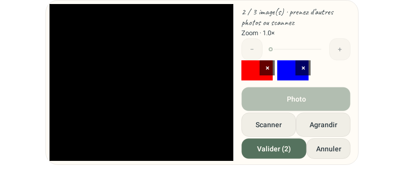
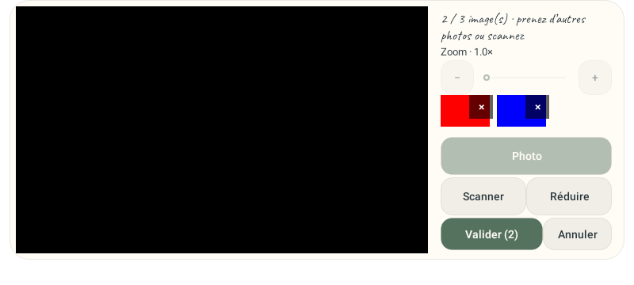
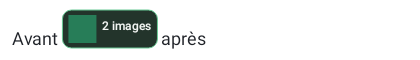
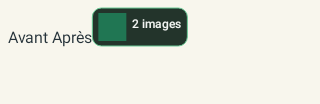
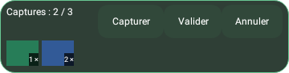
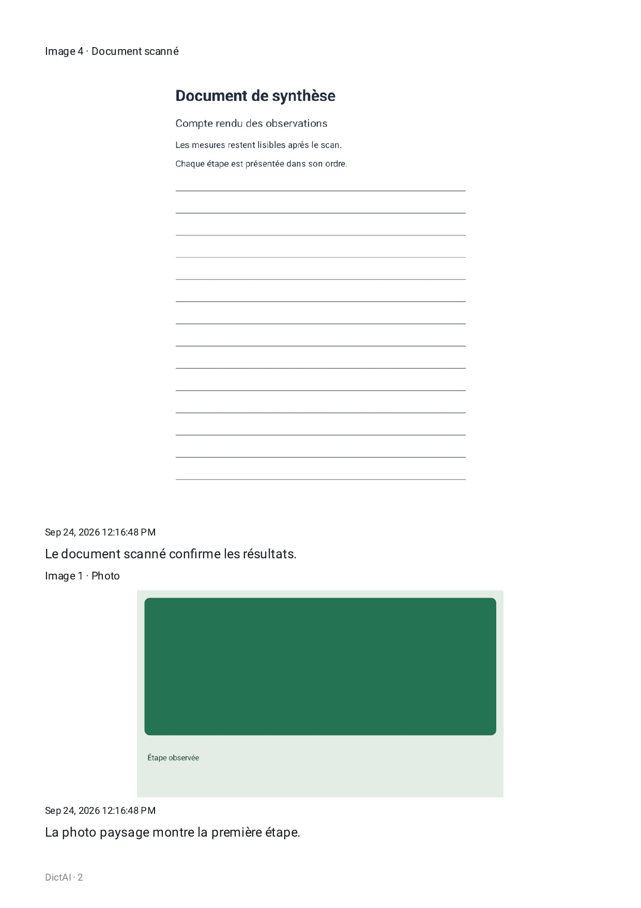

# Photos, scanner et blocs d’images dans DictAI

La capture conserve maintenant une série d’images jusqu’à sa validation. La série est insérée au curseur choisi avant l’ouverture de la caméra ou de la capture d’écran.

## APK local de test

[Ouvrir l’APK dans Téléchargements](/Users/ulliemaillot/Downloads/dictai-0.9.6-captures-scanner.apk)

Cette compilation provient de la branche `codex/dictai-0.9.6` et porte la version **0.9.6-dictai**, code **35**, du dépôt courant. Package : `com.uhama.whisperpin`. Taille : **88,2 Mo**. La copie livrée est identique à l’APK produit par Gradle.

SHA-256 : `214bd25d4fabba066f38ff9e5daeac011192f21f826162d07b0b77866a4db442`.

[Métadonnées de l’APK](media-2026-09-24/evidence/final-apk-metadata.json) · [Log de compilation](media-2026-09-24/evidence/final-assembleDebug.log) · [Sources revues inchangées après compilation](media-2026-09-24/evidence/production-snapshot-post-build.txt)

## Utilisation

1. Placer le curseur dans la transcription, puis toucher Photo ou Capture d’écran.
2. Dans la caméra, utiliser le pincement ou les commandes de zoom, et **Agrandir** pour agrandir la fenêtre caméra. **Scanner** ouvre la capture de documents avec recadrage et plusieurs pages.
3. Prendre plusieurs images, retirer celles à écarter avec **×**, puis **Valider**. La limite reste de dix images par note.
4. Toucher un bloc pour le sélectionner ; maintenir puis glisser pour le déplacer. Le menu d’une vignette propose aussi **Déplacer au curseur**.
5. Exporter la note en PDF ou en HTML. Les images restent compactes et conservent leurs proportions. Le HTML permet de les agrandir à la demande ; une capture très haute se consulte avec le zoom du lecteur PDF.

Le scanner repose sur [ML Kit Document Scanner](https://developers.google.com/ml-kit/vision/doc-scanner/android). Les services Google peuvent télécharger son module lors de la première utilisation. Les images sont traitées sur l’appareil. L’appareil photo reste utilisable si le scanner n’est pas disponible.

## Aperçus de l’interface

Les rendus ci-dessous utilisent des images synthétiques. Le viseur noir des captures Robolectric représente la surface Camera2, qui est vérifiée séparément sur l’émulateur.

## Exports vérifiés

[PDF produit sur Android](media-2026-09-24/mixed-note-android.pdf) · [HTML autonome](media-2026-09-24/mixed-note.html) · [Pages rendues et preuves détaillées](media-2026-09-24/evidence.md) · [Deux revues finales](media-2026-09-24/review.md)

Les trois pages du PDF ont été inspectées à 150 dpi : ordre 3, 4, 1, 2 respecté, texte avant/après conservé, scan lisible et aucune superposition. Les variantes HTML mobile, grand écran et image agrandie ont aussi été inspectées.

## État de vérification

La suite complète JDK 21 passe : **593 tests JVM/Robolectric, aucun échec, erreur ou test ignoré**, répartis dans 92 suites. Le lot ciblé de 61 tests couvre notamment l’ajout et la récupération d’une série dans le véritable service, les anciennes notes, la suppression des blocs, le glissement dans un champ défilant et les commandes accessibles.

**Cinq tests instrumentés ciblés ont réussi sur l’émulateur Android 36** : Camera2 prend deux photos avec un agrandissement entre les prises, puis attend la validation explicite ; les quatre tests médias/export vérifient le PDF natif et les traitements d’images. Les six vues de caméra, les deux vues de l’overlay, les trois pages PDF et les variantes HTML ont été inspectées.

[Résultats de la suite complète](media-2026-09-24/evidence/final-unit-tests-summary.txt) · [Log Gradle](media-2026-09-24/evidence/final-unit-tests.log) · [Lot d’intégration de l’overlay](media-2026-09-24/evidence/media-blocks-editor-combined.log)

Les gestes sur le Poco F7/Pad 7 et le parcours du scanner Google sur ces appareils restent à vérifier physiquement. Les essais sur émulateur ne remplacent pas cette vérification.
