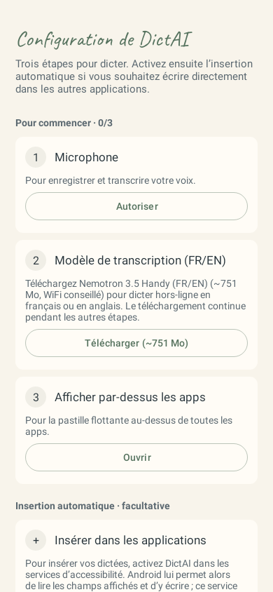
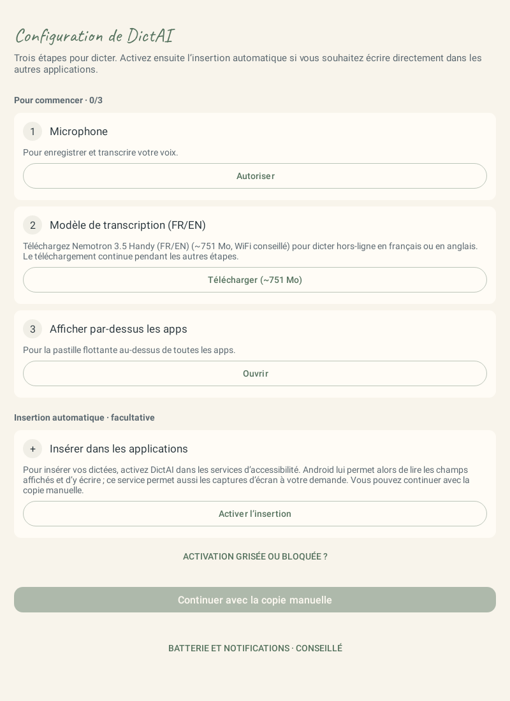
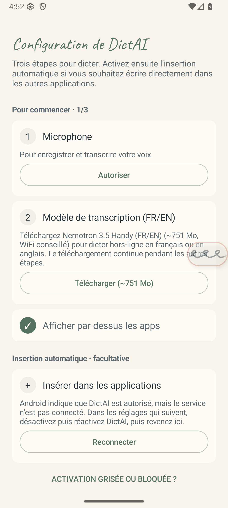
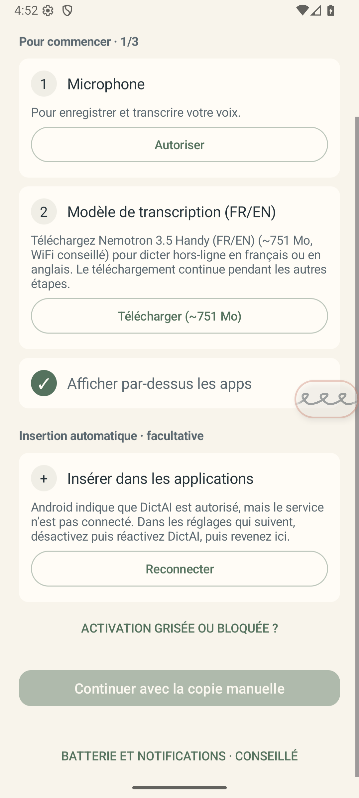

# DictAI — insertion et configuration initiale

Recherche et vérifications du 7 octobre 2026. Signalement : sur Xiaomi Pad 7, une dictée terminée n’est pas insérée dans le champ de l’application ouverte, notamment ChatGPT, malgré l’autorisation d’accessibilité.

## Résultat du diagnostic

Le Pad 7 n’est pas connecté à cet environnement. Le défaut exact de ChatGPT sur cet appareil reste à confirmer ; aucun essai sur ChatGPT n’est présenté comme effectué.

Un échec de compatibilité est reproduit sur Android 36 : un champ vide affiche un texte indicatif et ne fournit pas de position de curseur exploitable. DictAI refuse alors l’écriture directe et tente uniquement le collage. Si l’application n’implémente pas le collage d’accessibilité, le résultat est « copié », sans insertion. Le test utilise un véritable champ Android dans une application de test séparée, dont seule l’action de collage est volontairement refusée.

Le correctif reconnaît le texte indicatif comme tel et remplit directement le champ vide. Un texte existant dont la sélection est inconnue n’est jamais remplacé arbitrairement. Android fournit précisément l’indicateur `isShowingHintText` pour distinguer un texte indicatif du contenu saisi. [Référence Android](https://developer.android.com/reference/android/view/accessibility/AccessibilityNodeInfo#isShowingHintText()).

Autre correction vérifiée : la connexion d’insertion est retirée dès `onUnbind`, sans attendre la destruction du service. Un service déconnecté ne doit pas rester annoncé comme actif. Le nouveau diagnostic **Réglages → Dernière insertion** distingue le service indisponible, l’absence de champ, la perte de focus, la sélection inaccessible et le refus de l’application. Il est local et ne conserve ni dictée ni contenu du champ.

## Configuration simplifiée dans cette version

- Trois prérequis pour dicter : microphone, modèle local, autorisation de la pastille.
- Un modèle déjà installé est accepté, même s’il diffère du modèle recommandé.
- L’insertion automatique est proposée séparément ; la copie manuelle permet de commencer sans activer l’accessibilité.
- Les notifications, la batterie et les réglages Xiaomi complémentaires ne bloquent plus le démarrage. Ils restent accessibles dans une section conseillée.
- L’autorisation et la connexion réelle du service sont distinguées. Une reconnexion tardive actualise l’écran ; le retour d’une demande de permission actualise immédiatement l’étape.
- Une aide explique le réglage des paramètres restreints sur Android 13+, pas seulement sur Xiaomi. Elle apparaît à la demande lorsque l’activation est grisée ou bloquée.
- L’assistant ouvre la rubrique d’accessibilité Android et indique comment activer ou reconnecter DictAI. Le raccourci privé vers la page du service a été testé puis écarté : Android 16 le réserve au système.

## Ce que permet Android

| Possibilité | Conclusion et décision |
|---|---|
| Activer automatiquement l’accessibilité | Android réserve l’activation à l’utilisateur dans les réglages. Le système gère la connexion. L’app peut guider et vérifier, pas accorder cette autorisation elle-même. [Cycle de vie officiel](https://developer.android.com/reference/android/accessibilityservice/AccessibilityService). |
| Demander moins d’autorisations d’un coup | Les demandes doivent accompagner la fonctionnalité qui en a besoin ; un refus doit permettre une utilisation adaptée. Appliqué au parcours proposé. [Recommandations Android](https://developer.android.com/training/permissions/requesting). |
| Rendre les notifications facultatives | `POST_NOTIFICATIONS` n’est pas nécessaire pour lancer un service au premier plan, même si ce service doit toujours créer sa notification. L’ancienne étape obligatoire était donc trop contraignante. [Documentation Android](https://developer.android.com/develop/ui/compose/notifications/notification-permission). |
| Réduire les allers-retours dans les réglages | AOSP définit une action vers la page du service, mais celle-ci est une API système cachée. L’essai Android 16 refuse son ouverture sans `OPEN_ACCESSIBILITY_DETAILS_SETTINGS`. Cette voie est écartée ; le code utilise la rubrique publique d’accessibilité. [Source AOSP](https://android.googlesource.com/platform/frameworks/base/+/refs/heads/android16-release/core/java/android/provider/Settings.java). |
| Simplifier les paramètres restreints | Android peut les imposer après une installation par APK. L’aide Google indique le menu ⋮ de la fiche de l’app. Les observations précédentes du projet placent aussi cette option en bas de page sur HyperOS ; son emplacement dépend de la version. [Aide Google](https://support.google.com/android/answer/12623953). |
| Passer par Google Play | Une distribution officielle mérite d’être étudiée pour réduire les manipulations liées aux APK et aux mises à jour. Ce n’est pas une suppression des permissions : l’utilisation de l’accessibilité nécessite notamment une déclaration et, selon le cas, une information et un consentement explicites. Aucune publication Play n’est réalisée ici. [Règles Google Play](https://support.google.com/googleplay/android-developer/answer/10964491). |

## Deux pistes d’évolution

**À court terme : conserver la pastille et mieux diagnostiquer l’insertion.** C’est le comportement actuel attendu par l’utilisateur. Le correctif des champs vides et le diagnostic sont livrés sans ajouter de nouvelle autorisation. La confirmation sur Pad 7 doit porter sur un champ ChatGPT vide, puis déjà rempli, et sur le texte sélectionné.

**Pour une saisie moins dépendante de l’accessibilité : proposer un clavier vocal DictAI facultatif.** Un service de clavier Android écrit via `InputConnection.commitText` dans l’éditeur actif. J’en déduis qu’un mode de dictée intégré au clavier peut éviter les permissions d’accessibilité et de superposition pour ce mode de saisie. Il exige toutefois d’activer et de sélectionner le clavier DictAI, en plus du microphone ; il ne remplace pas à lui seul les notes flottantes ni les captures d’écran. Recommandation : expérimenter cette option sans imposer un changement de clavier. [Création d’un clavier Android](https://developer.android.com/develop/ui/views/touch-and-input/creating-input-method).

Android 13+ propose également des API de saisie aux services d’accessibilité via `FLAG_INPUT_METHOD_EDITOR`. Cette piste pourrait améliorer la compatibilité tout en conservant le clavier actuel, mais elle conserve l’autorisation d’accessibilité. Elle nécessite un prototype avec gestion des changements de champ et vérification de l’insertion pour éviter une double écriture ; elle n’est pas activée dans ce correctif. [Indicateur Android](https://developer.android.com/reference/android/accessibilityservice/AccessibilityServiceInfo#FLAG_INPUT_METHOD_EDITOR), [connexion de saisie](https://developer.android.com/reference/android/accessibilityservice/InputMethod.AccessibilityInputConnection).

## Vérifications et aperçus

Les images ci-dessous sont des rendus de la véritable activité Android, produits avec le moteur natif Robolectric, puis inspectés visuellement. Le parcours reste défilable sur téléphone ; les actions sont placées sous les explications pour éviter les colonnes trop étroites.

| Téléphone | Tablette |
|---|---|
|  |  |

Captures de l’émulateur Android : l’autorisation reste activée tandis que le service est déconnecté après l’instrumentation. L’assistant affiche alors « Reconnecter » au lieu de demander à nouveau l’autorisation.

| Haut de l’écran | Suite après défilement |
|---|---|
|  |  |

Vérification locale : **735 tests JVM/Robolectric réussis**, compilation APK et trois tests Android réels réussis (champ vide standard, champ vide sans collage, conservation du texte déjà saisi).

Les résultats détaillés et les preuves Android sont enregistrés dans `docs/research/insertion-setup/`. La validation physique Pad 7 / ChatGPT reste nécessaire.
