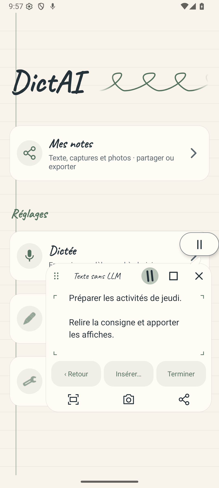
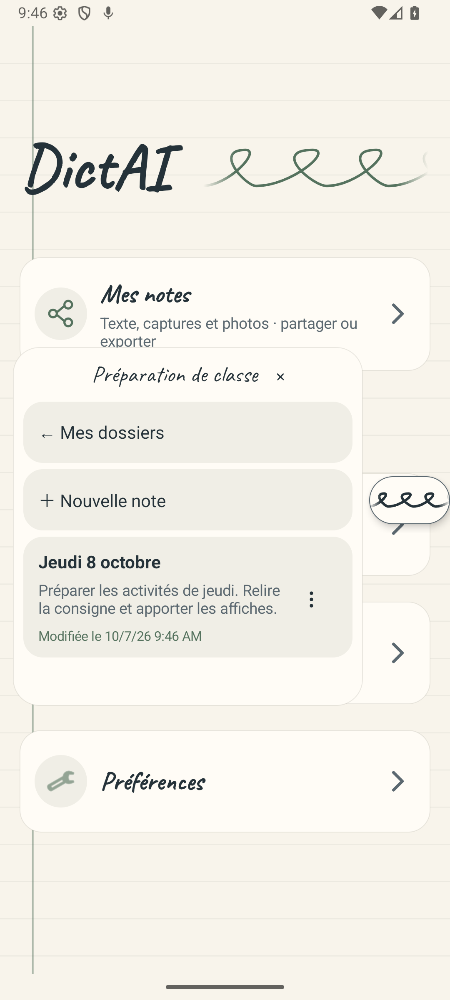
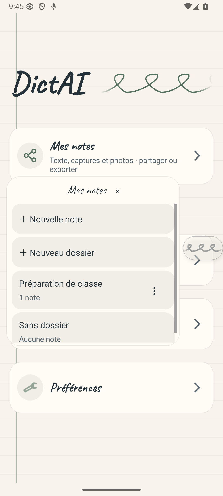

# Retour dans les notes et les dossiers

Dans DictAI Android, le bouton **‹ Retour** enregistre la note ouverte et revient à son dossier. Un glissement horizontal vers la droite dans le contenu permet la même action. Depuis le dossier, **← Mes dossiers** ou un second glissement ramène à la racine.

**Terminer** conserve désormais le dossier de la note. Cette destination est également utilisée après la fin différée d’une transcription et après le premier choix de classement. Les notes sans dossier conservent leur parcours ; un dossier supprimé ne bloque pas le retour.

Le geste ignore les déplacements verticaux, les gestes vers la gauche, les gestes annulés, les appuis longs et le multitouch. Il laisse la sélection de texte et les poignées de déplacement/redimensionnement disponibles. Il est prévu pour la consultation ; pendant l’édition, le bouton Retour permet également de quitter la note. Les poignées natives du curseur peuvent intercepter un geste avant que le panneau le reçoive.

## Vérification

Les tests de régression exercent les véritables vues et listeners du service : sauvegarde des retouches, note nouvelle/existante, ouverture directe, dossier supprimé, notes sans dossier, boutons, gestes et interactions avec l’éditeur. Les régressions de dossier, de retour et de redimensionnement ont été reproduites avant correction.

Le parcours a aussi été exécuté dans l’APK sur un émulateur Android 36 isolé : ouverture du dossier, consultation de la note, retour par geste, retour à la racine, puis retour par Terminer et par le bouton Retour. La note de démonstration et son rattachement au dossier ont été relus dans le stockage Android après ce parcours.

Les captures ci-dessous proviennent de cet émulateur. Elles ont été inspectées visuellement : trois boutons lisibles, sans chevauchement, et dossier conservé après fermeture. Aucun téléphone physique n’était connecté ; le ressenti tactile Poco/Pad reste à confirmer. Cette livraison est un APK local, sans publication GitHub Actions.

## Aperçus Android

| Note avec Retour | Après Terminer : même dossier | Après le retour du dossier : racine |
| --- | --- | --- |
|  |  |  |

[Retour de la note par glissement](research/notes-navigation/android-after-note-swipe.png) · [Retour par bouton](research/notes-navigation/android-after-back-button.png)

Les résultats de compilation, le nombre de tests et l’empreinte de l’APK livré sont consignés dans [verification.json](research/notes-navigation/verification.json).
