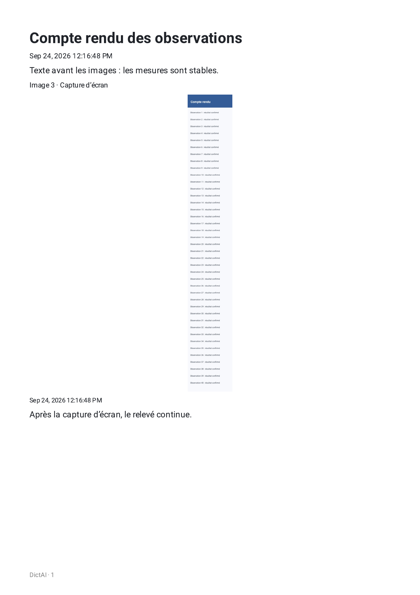
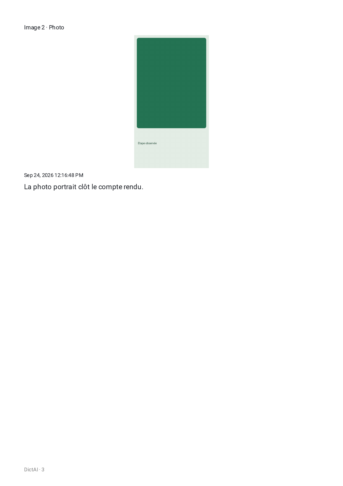
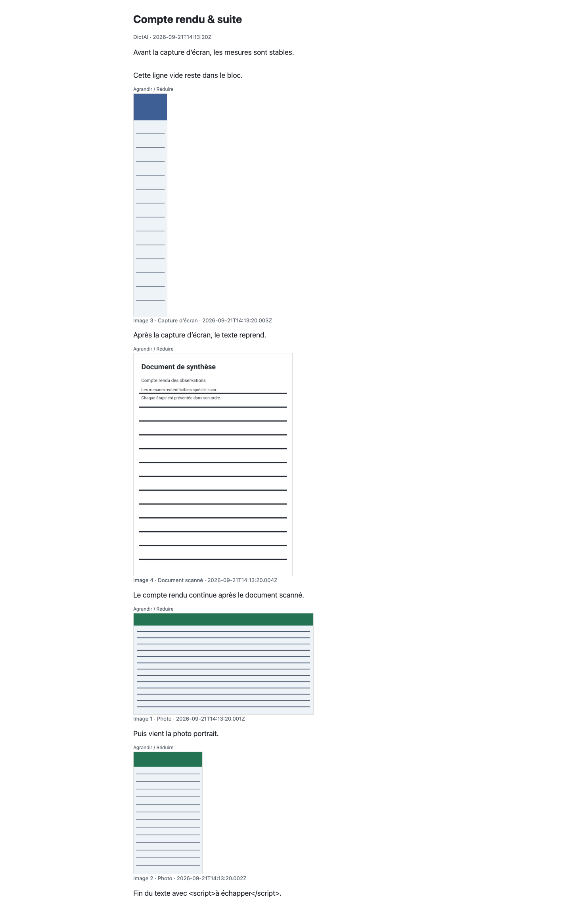
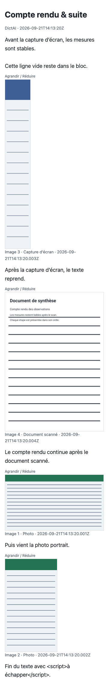
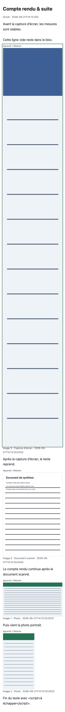

# Preuves des exports médias

Fixture synthétique avec photos paysage/portrait, capture d’écran verticale (360 × 2400) et document scanné. Le PDF a été produit par `NotePdfExport` sur l’AVD Android, puis relu avec `PdfRenderer` : **3 pages A4, 595 × 842 pt**, sans page vide. L’extraction `pdftotext` confirme le texte avant et après les images dans l’ordre 3, 4, 1, 2.

[PDF Android](mixed-note-android.pdf) · [HTML autonome](mixed-note.html) · [résultats instrumentés JUnit](evidence/AndroidExportAndMediaTests.xml) · [log du PDF](evidence/AndroidPdfFixtureTest-logcat.txt) · [résultat JVM export/renderer](evidence/JVM-export-renderer-run.txt)

Les quatre tests instrumentés réussissent sur `Medium_Phone_API_36.0` : la fixture PDF et les trois cas de `NoteMediaAndroidTest`. Les tests JVM ciblés réussissent également pour les dimensions, la fixture HTML et le rendu des blocs. Robolectric n’implémente pas `PdfDocument` (`IllegalStateException: document is closed!`) ; la preuve PDF provient donc du moteur Android réel, sans conversion PDF de navigateur.

## Pages PDF — PNG à 150 dpi

## HTML — navigateur Chrome

Le HTML reste compact par défaut. Sur mobile 360 px, la capture d’écran verticale fait 86 × 562 px repliée et 330 × 2189 px après ouverture du contrôle au clavier. Le style d’impression la plafonne à 560 px de haut (420 pt). Le fichier conserve une seule source base64 par image, n’intègre aucun script et limite le CSP aux images locales et au style.

## Bloc image inline dans l’éditeur

