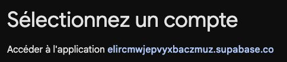
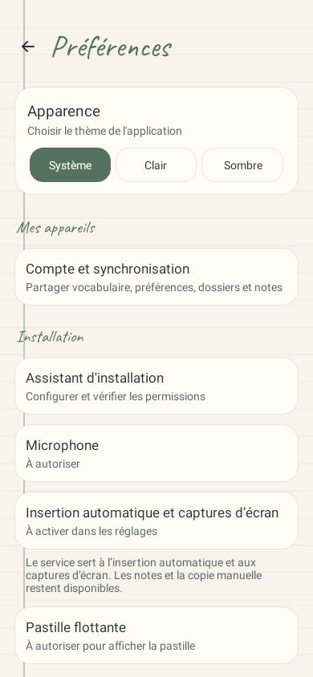
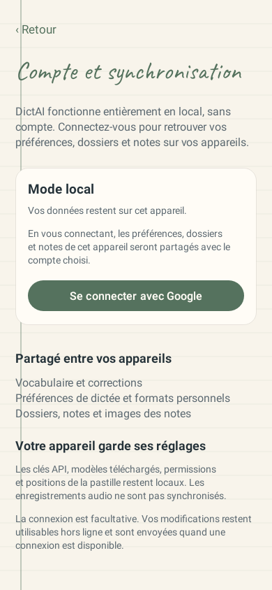
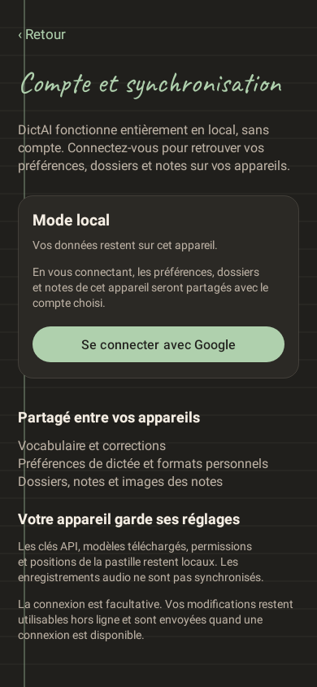
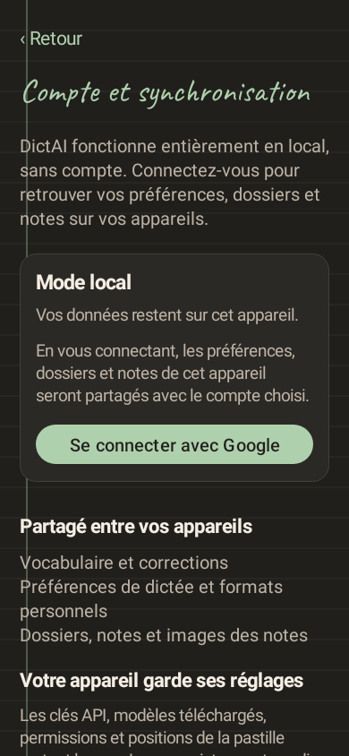
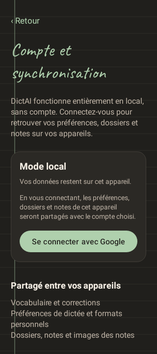
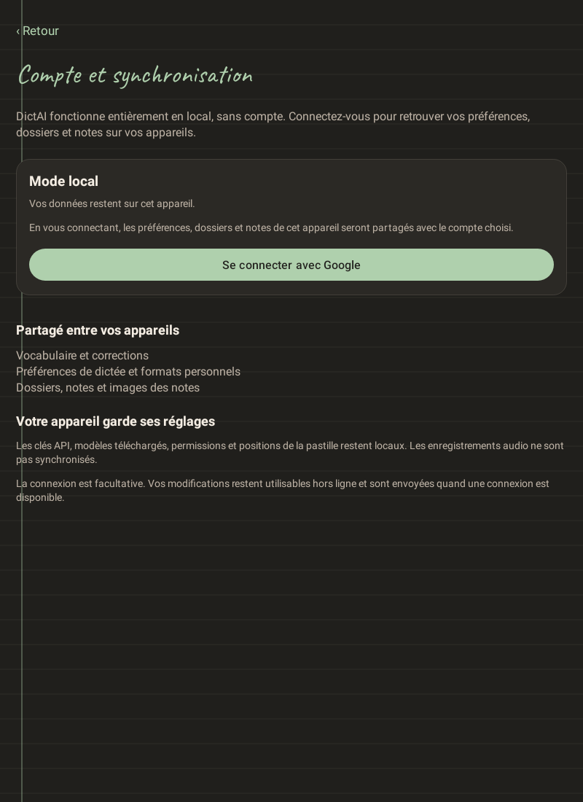

# Synchronisation des appareils DictAI

La branche `codex/device-preferences-sync` ajoute un compte Google facultatif. DictAI reste gratuit et utilisable localement ; la connexion sert à partager le vocabulaire, les préférences communes, les formats personnels, les dossiers, les notes enregistrées et leurs images entre les appareils du compte.

## Choix d’hébergement

Supabase fournit les comptes Google, PostgreSQL et le stockage privé des images. Ce choix répond au besoin d’un compte hébergé propre au produit, avec des règles d’accès vérifiables en SQL et une base PostgreSQL portable. Il ne nécessite pas un accès Google Drive. L’authentification utilise le navigateur système et [OAuth PKCE](https://supabase.com/docs/guides/auth/sessions/pkce-flow) ; le secret Google reste côté hébergement. La configuration est conforme au [guide Google de Supabase](https://supabase.com/docs/guides/auth/social-login/auth-google).

Un projet dédié **DictAI Sync** est créé à Paris, région `eu-west-3`, référence `elircmwjepvyxbaczmuz`, dans l’organisation gratuite existante. Le projet Google Cloud `dictai-sync-20261005` est créé sans compte de facturation lié. Les deux migrations sont déployées sur Supabase. Le 6 octobre 2026, les conditions Google sont validées, le client Web dédié est créé et le fournisseur Google est activé dans Supabase.

L’offre [Supabase Free](https://supabase.com/pricing) convient aux premiers appareils : ses quotas et la [mise en pause après inactivité](https://supabase.com/docs/guides/platform/free-project-pausing) limitent une exploitation publique durable. Aucun abonnement utilisateur ni passage automatique à une offre payante n’est ajouté. Le mainteneur devra préparer des sauvegardes externes avant une distribution publique ; les [sauvegardes quotidiennes gérées](https://supabase.com/docs/guides/platform/backups) ne sont pas incluses dans Free.

## Données et sécurité

| Synchronisées après connexion | Conservées sur chaque appareil |
| --- | --- |
| Vocabulaire, corrections apprises | Clés API et autres secrets |
| Langue, nombres, thème, préférences communes | Modèles téléchargés et sélection du modèle local |
| Formats personnels, choix du format et du modèle cloud | Permissions et position de la pastille |
| Dossiers, titres, texte et classement des notes | Audio, diagnostics et brouillons de dictée inachevés |
| Images originales des notes et leur ordre | Captures en attente, cache caméra et miniatures |

Les données existantes de l’appareil rejoignent le compte choisi lors de la connexion. Une déconnexion retire la session et arrête les échanges ; les données locales restent disponibles. Elle ne supprime pas le compte hébergé.

Chaque requête porte la session de l’utilisateur. PostgreSQL impose [RLS](https://supabase.com/docs/guides/database/postgres/row-level-security), `auth.uid()` et des privilèges limités. La table interdit DELETE, TRUNCATE et le changement de propriétaire d’une réplique. Les [limites de RLS](https://www.postgresql.org/docs/current/ddl-rowsecurity.html) sur TRUNCATE imposent une révocation explicite des privilèges hérités.

Les JPEG sont dans un [bucket privé](https://supabase.com/docs/guides/storage/security/access-control), sous le chemin UUID du compte et leur SHA-256. Les objets sont immuables côté client ; une tentative répétée d’envoi ne réussit qu’après vérification de l’objet existant. Les [téléchargements authentifiés](https://supabase.com/docs/guides/storage/serving/downloads) utilisent HTTPS, sans URL publique ni jeton dans l’URL. Les sessions Android utilisent AES-GCM et AndroidKeyStore ; elles sont séparées par projet hébergé. Les sauvegardes et transferts système excluent les identités des répliques et les secrets.

Le contenu hébergé n’est pas chiffré de bout en bout. L’administrateur de l’hébergement peut le gérer. Les anciennes répliques, reçus de suppression et images peuvent conserver du contenu supprimé ; cette première version ne propose pas encore l’effacement du compte depuis l’app ni le nettoyage automatique des images hébergées. Ces points doivent être finalisés avant une diffusion publique. Voir [PRIVACY.md](../../../PRIVACY.md).

## Fonctionnement et limites

Chaque installation possède une réplique. Les horloges logiques et les identités d’appareil départagent les changements du même champ ; les ajouts indépendants se fusionnent. Les suppressions persistent pour empêcher le retour d’un ancien appareil de ressusciter les données. Les versions concurrentes des notes sont conservées sous forme de copies déterministes. L’éditeur actif conserve son texte et peut être rattaché à sa version conservée.

Un journal durable couvre préférences, formats, dossiers et notes. Les contenus reçus sont entièrement validés avant import. Les images et miniatures nécessaires sont présentes avant les notes ; les originaux sont envoyés avant publication du document. Une reprise répare les images manquantes du journal avant de finaliser l’import. Aucun travail de synchronisation ne démarre le microphone.

Après une modification, l’app attend brièvement pour regrouper les changements, puis planifie un échange réseau. Elle peut aussi lancer un échange à l’ouverture de l’écran de compte ou avec « Synchroniser maintenant ». Le travail périodique utilise le [minimum Android de 15 minutes](https://developer.android.com/reference/androidx/work/PeriodicWorkRequest) ; Android et HyperOS peuvent le retarder. Un appareil peut conserver des changements en attente jusqu’à son prochain échange. Il ne s’agit pas d’une édition collaborative instantanée.

Les limites protègent la mémoire et les transferts : document 8 Mio, note sérialisée 1 Mio, entrée de préférence ou métadonnée 8 192 caractères, 10 000 entrées, 100 répliques et 32 Mio cumulés par lecture de compte. Les JPEG sont limités à 8 Mio par original. Les historiques et échappements JSON comptent dans ces tailles. Une bibliothèque trop volumineuse interrompt l’échange et reste locale ; aucune troncature n’est appliquée.

## Configuration reproductible

1. Déployer les deux fichiers de `supabase/migrations/` dans un projet dédié. La seconde migration vérifie RLS déjà activé sur les tables gérées de Storage, sans modifier leur propriétaire.
2. Créer un client Google de type **Application Web**, avec le retour exact `https://elircmwjepvyxbaczmuz.supabase.co/auth/v1/callback`. Pour un autre projet, adapter uniquement sa référence. Déclarer uniquement les scopes d’identité `openid`, `userinfo.email`, `userinfo.profile` dans Google. L’app demande explicitement `openid` ; Supabase ajoute `email` et `profile`, conformément à son [fournisseur Google](https://github.com/supabase/auth/blob/master/internal/api/provider/google.go).
3. Configurer ce client et son secret dans Supabase Auth, fournisseur Google. Autoriser le retour natif `com.uhama.whisperpin://auth/callback**` pour inclure le paramètre `flow`. L’app valide strictement le chemin et ce paramètre aléatoire.
4. Le build utilise déjà le projet dédié via `app/sync-client.properties`. Pour un autre hébergement, définir `DICTAI_SUPABASE_URL` et `DICTAI_SUPABASE_PUBLISHABLE_KEY`, ou les propriétés Gradle `dictaiSupabaseUrl` et `dictaiSupabasePublishableKey`. Ces valeurs sont publiques ; aucune clé `secret` ni `service_role` ne doit entrer dans l’APK. Voir les [types de clés Supabase](https://supabase.com/docs/guides/getting-started/api-keys).
5. Installer le même APK sur téléphone et tablette, puis choisir le même compte Google dans **Préférences → Mes appareils → Compte et synchronisation**.

Les secrets de création du projet, du client Google et du contrôle serveur restent hors du dépôt, dans la configuration privée du mainteneur. L’accord sur les conditions Google a été validé par le mainteneur. Aucun consentement utilisateur à la connexion n’a été donné pendant la préparation du client.

## Preuves et vérification

Après le refus signalé sur Pad 7, le build de synchronisation passe à `0.9.13-dictai` / code `42`. Les anciennes publications du même package atteignaient le code `41` ; Android [refuse un code inférieur à celui déjà installé](https://developer.android.com/studio/publish/versioning). Sur un émulateur Android 36 ARM64 isolé, l’APK Actions de code `35` est effectivement refusé par-dessus la release Gemma 3 de code `41` (`INSTALL_FAILED_VERSION_DOWNGRADE`). La mise à jour vers `42` réussit avec la même signature, sans désinstallation. Une note avec son dossier, son JPEG original et le vocabulaire de test sont conservés après installation et lancement. Les preuves sont dans `install-update.json`. La version réellement installée sur la tablette reste à confirmer ; ce contrôle ne valide pas les fonctions expérimentales du pilote Gemma 3 dans le build normal.

Les tests JVM et Robolectric couvrent fusion, suppressions, conflit de notes, reprise du journal, exclusion des secrets, OAuth, renouvellement de session, garde de compte, pièces jointes, profondeur JSON et limites mémoire. Les scénarios ont été observés en échec avant leur implémentation. La suite complète passe sous JDK 21 : 714 tests, aucun échec ni test ignoré. `assembleDebug`, la signature de l’APK et les contrôles ELF et ZIP 16 Ko passent également. Le nouvel APK d’essai est `dictai-device-sync-preview-2026-10-06.apk` ; son SHA-256 est enregistré dans `apk.sha256`.

Les fixtures `supabase/tests/preference_accounts.sql` et `note_attachments.sql` passent avec PostgreSQL PGlite. Sur le véritable hébergement, deux sessions Auth temporaires ont vérifié l’écriture et la lecture propres, le refus des accès entre comptes et des accès anonymes, puis l’envoi et la restitution exacte d’un JPEG privé. Les comptes et leur image de test ont été nettoyés. Cette preuve ne remplace pas le parcours Google de l’APK ni les essais physiques Poco F7 et Pad 7.

Le service Auth actif a aussi été vérifié : fournisseur Google disponible, redirection OAuth PKCE vers Google avec le client et le retour attendus, et uniquement les scopes `email`, `openid`, `profile`. Dans Chrome, le parcours atteint « Sélectionnez un compte » pour `elircmwjepvyxbaczmuz.supabase.co`, sans erreur de client ou de retour OAuth. Aucun compte n’a été sélectionné. La vérification est enregistrée dans `google-activation.json`. Elle ne prouve pas encore une session Google complète dans l’app.

Les images suivantes sont des rendus Android natifs inspectés. Elles montrent le build configuré pour le projet dédié, avant toute connexion utilisateur. Le retour dans l’app et la synchronisation sur les appareils physiques restent à valider.

Pour la validation physique : ajouter un dossier, une note avec photo et une correction sur le téléphone ; vérifier leur arrivée sur la tablette. Passer hors ligne, modifier deux notes ou deux versions de la même note, puis reconnecter les appareils et vérifier les textes et originaux. Tester une suppression pendant l’édition d’une note sur l’autre appareil, la déconnexion et le redémarrage de l’application. La dernière date d’échange affichée constitue un état local ; elle ne prouve pas à elle seule la réception sur l’autre appareil.
