# Réunion test3 — audit visuel des gestes

**Captures de l’APK test3, révision 10.** Le cercle Réunion est agrandi : environ 33,6 dp de diamètre tracé dans la pastille de 74 × 44 dp. La marge visible reste d’environ 5,2 dp en haut et en bas. APK SHA-256 : `ca50108b3197c1647d6f51f25ae6871fe1456e715d8b1ce63381e8b9edac7147`.

Parcours exécuté sur émulateur Android ARM64 API 36 avec de vrais événements tactiles. Les paroles et intervenants sont simulés : ces captures vérifient l’interface, pas la reconnaissance vocale. Le scénario est vert en 17,325 secondes sur l’utilisateur principal de l’émulateur (journal final des gestes, révision 10).

Les 13 images natives du parcours gestuel, de 1080 × 2400 pixels, ont été inspectées. Le cercle reste contenu dans la pastille au repos, en écoute et pendant la fermeture. Les menus de dossiers restent lisibles, la pastille demeure accessible dans les nouveaux parcours et le retour affiche la racine. La liste principale défile quand son contenu dépasse la hauteur disponible. Le texte reste affiché pendant l’annulation. Les étapes de retouche, pause, confirmation et création d’une nouvelle session restent fonctionnelles.

## Cercle agrandi : pause et rotation

Les cinq captures supplémentaires ci-dessous ont été inspectées. Le test de dessin natif passe en 9,308 secondes. La pastille centrale utilise ses dimensions réelles ; l’aperçu de 216 × 216 dp permet de voir la courbe en détail. Les deux angles de rotation et la reprise de pause gardent une marge ; le retour en Dictée retrouve l’onde horizontale et sa hauteur de dessin de 32 dp. Aucun audio ni modèle n’est utilisé par cette fixture.

| Réunion en pause | Rotation, premier instant |
| --- | --- |
|  | 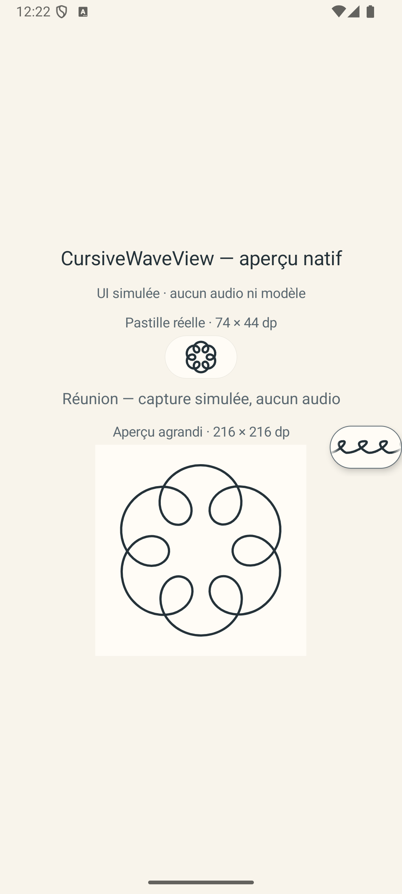 |

| Rotation, second instant | Retour en pause |
| --- | --- |
| 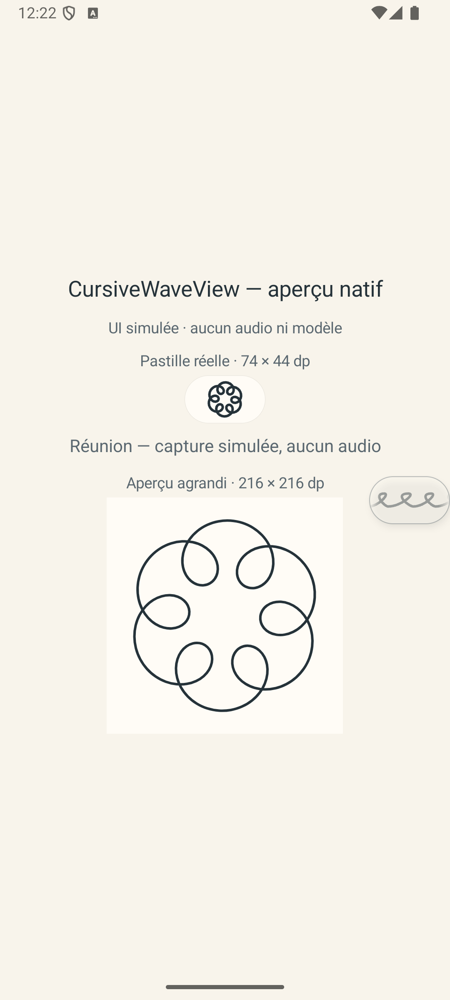 | 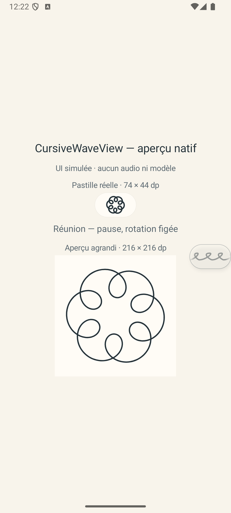 |

Retour en Dictée

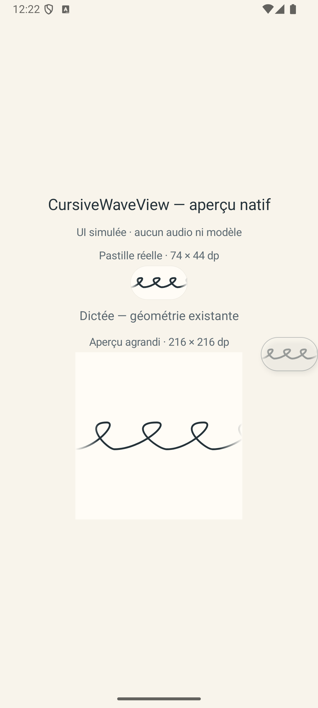

## Navigation et annulation

| Dossier avant le geste sur la liste | Racine après le geste sur la liste |
| --- | --- |
| 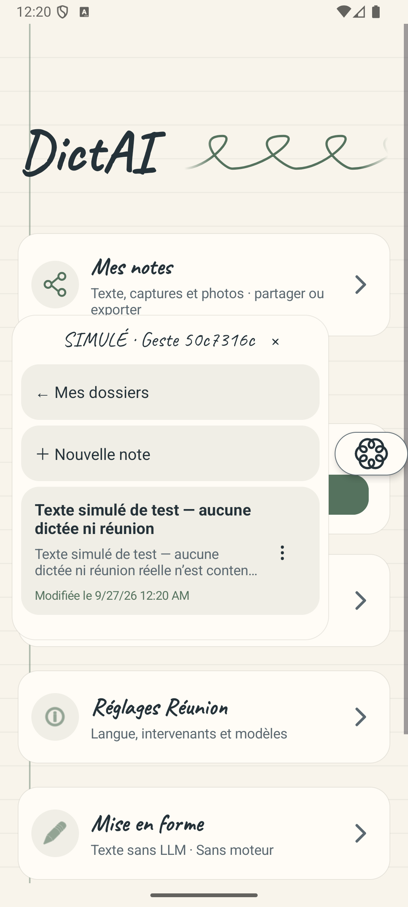 | 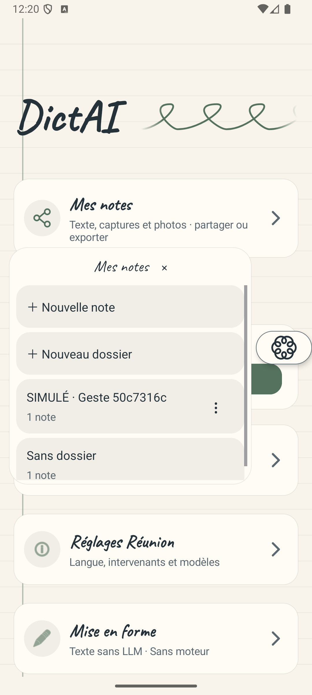 |

| Dossier avant le geste sur la pastille | Racine après le geste sur la pastille |
| --- | --- |
| 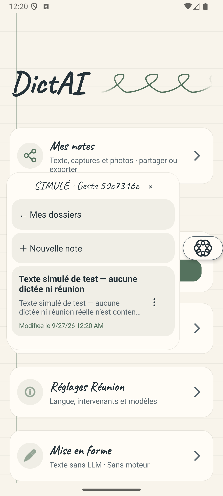 |  |

| Dossier pendant une réunion simulée | Retour à la racine, réunion toujours active |
| --- | --- |
| 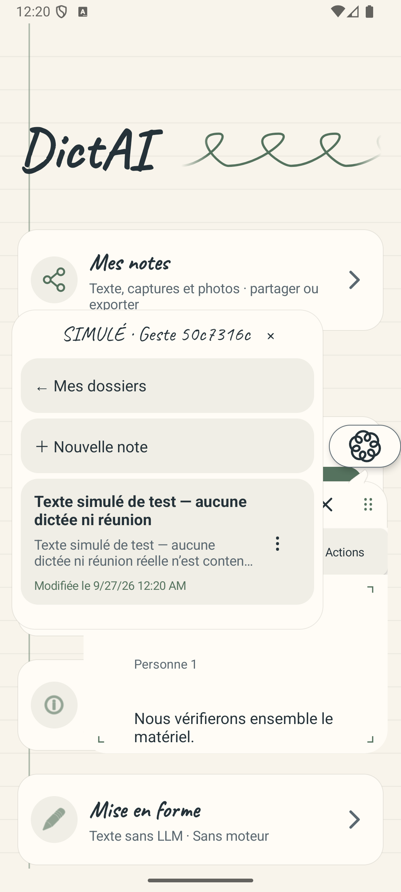 | 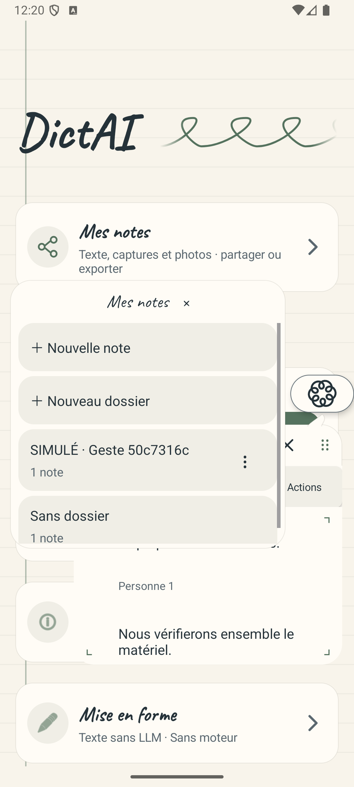 |

| Réunion simulée avant annulation | Fermeture après le geste, texte conservé |
| --- | --- |
| 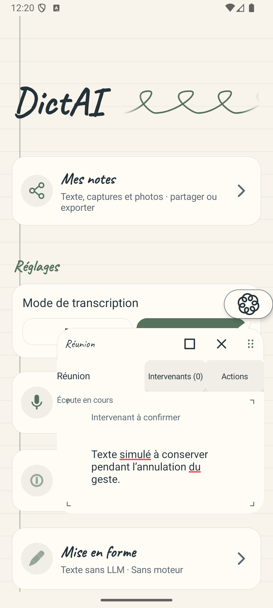 | 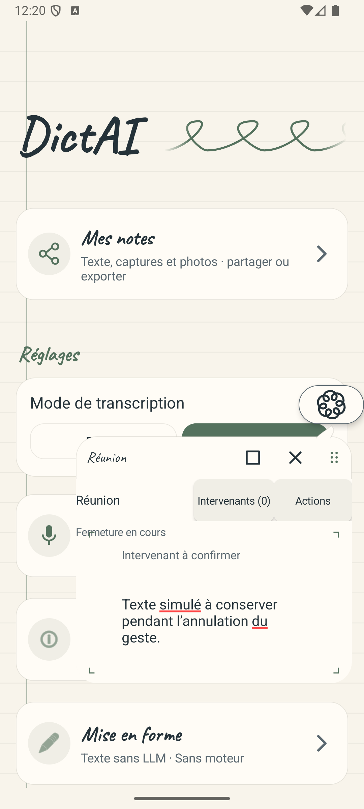 |

| Sélection du mode sans démarrage du micro | Retouche du texte et du nom |
| --- | --- |
| 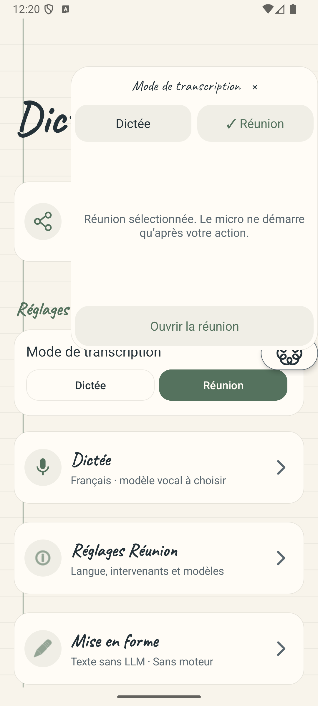 | 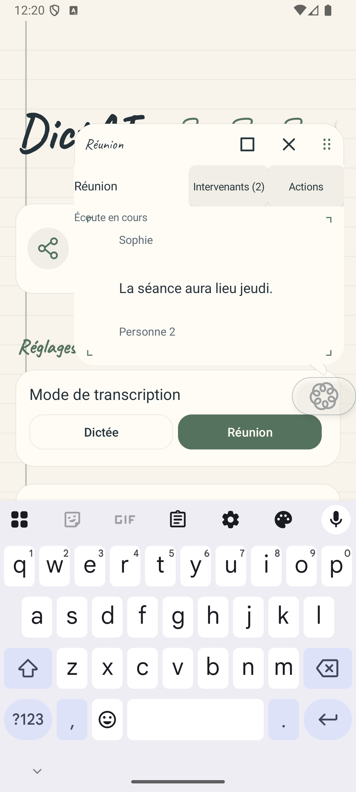 |

| Confirmation après pause | Note enregistrée avec la retouche |
| --- | --- |
| 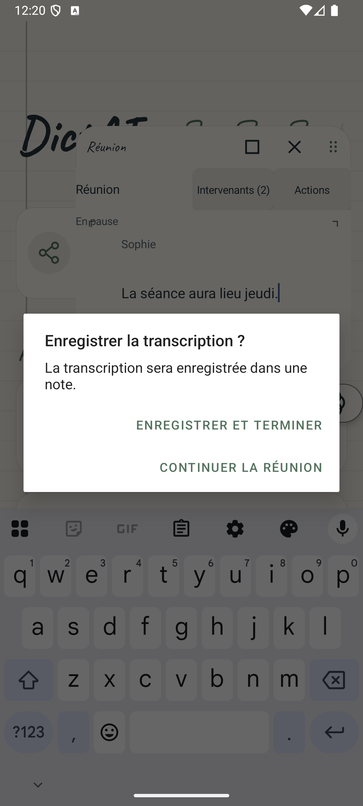 |  |

Nouvelle session vide

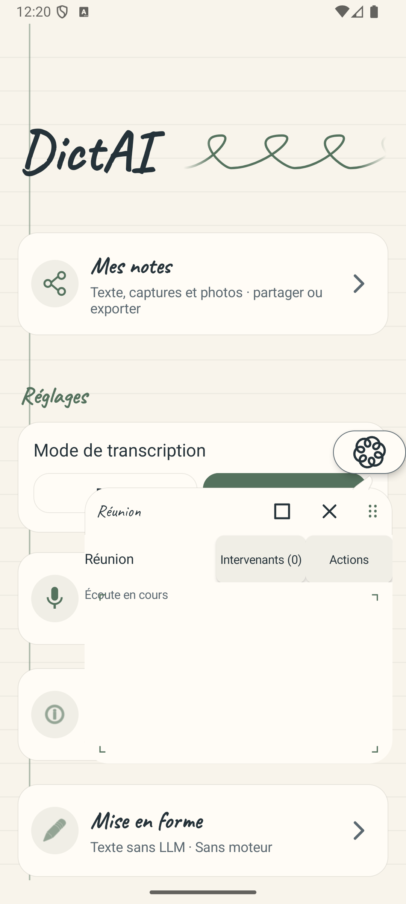

## Parcours du moteur de production, avant le micro

Ces deux captures supplémentaires ont été inspectées. Elles montrent le menu ouvert depuis Dictée, puis le panneau Réunion prêt avant le démarrage du micro. Le test AudioRecord passe en 24,948 secondes ; ses états d’écoute, pause et fermeture sont établis par les journaux, pas par ces images. La galerie comporte au total 20 captures.

| Menu depuis Dictée | Réunion prête avant le micro |
| --- | --- |
| 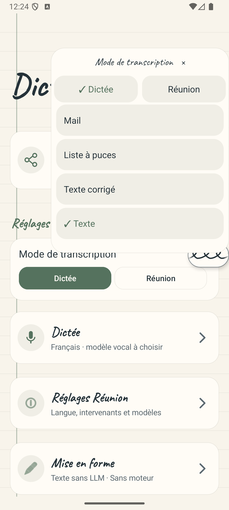 | 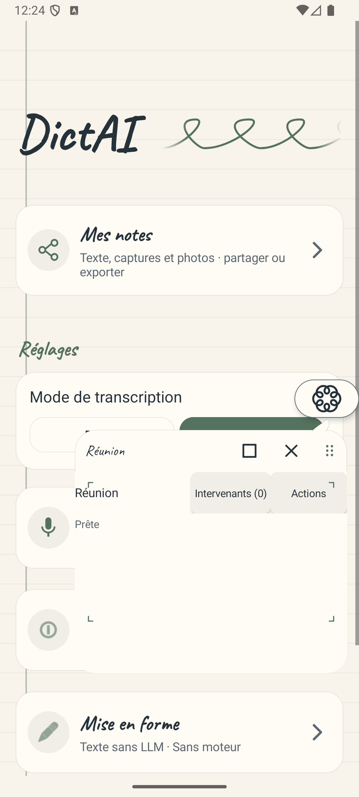 |
