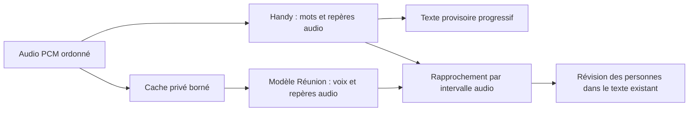
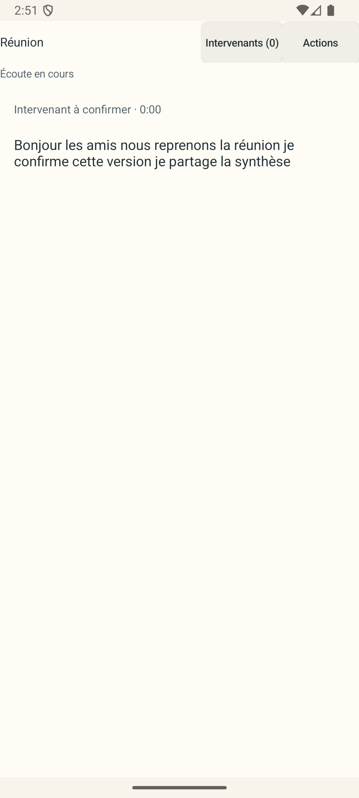
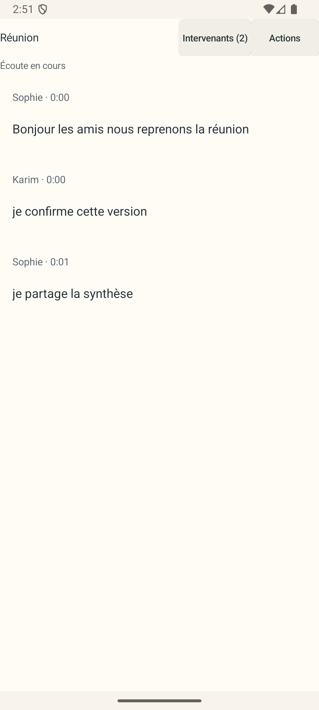
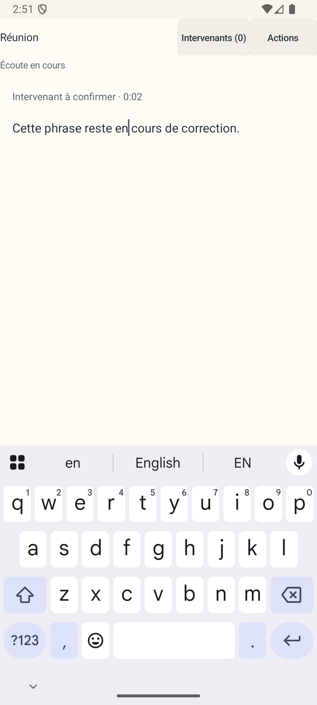

# Réunion test6 : attribution différée sur l’audio d’origine

État : version d'essai **test6 / 40 publiée et vérifiée sur GitHub Actions**. Tests JVM et présentation Android validés ; essai des moteurs natifs non concluant avant l'envoi d'audio. Démarrage, latence et précision des personnes restent à valider sur le Poco F7.

## Problème et comportement attendu

L’essai physique de test5 montre une accumulation du retard des voix, des fragments isolés et des lignes sans texte. L’enregistrement d’écran fourni est silencieux : il permet d’évaluer l’interface, mais pas de mesurer la fidélité des mots ni la justesse des personnes. Les médias privés restent hors du dépôt.

Handy conserve la transcription progressive. L’identification des voix peut arriver plus tard et réviser les passages déjà affichés. Le rapprochement repose sur les positions absolues dans le même flux PCM, depuis le premier échantillon ; aucune constante de latence calculée à partir du délai de réception des réponses n’est ajoutée aux horodatages.

Exemple : une voix identifiée sur l’intervalle audio 12–15 secondes doit réviser les mots de cet intervalle, même si son résultat arrive lorsque la capture atteint 80 secondes. La vitesse des deux branches peut différer ; leur origine temporelle et les échantillons admis doivent rester communs.

## Défauts reproduits avant correction

- Les chunks de mots encore révisables étaient purgés avec un seuil situé 120 secondes derrière l’avancement de Handy, même si les voix n’avaient pas encore analysé leur intervalle. Le chemin des snapshots inchangés produisait la même perte.
- La file des voix arrêtait l’attribution au-delà de 120 secondes en mémoire. Le test bloque le calcul des voix, admet 130 secondes de PCM et constate l’état indisponible alors que Handy continue.
- Un suffixe provisoire non retouché était protégé comme un ancrage manuel. Les fragments restaient séparés après l’arrivée des temps et des voix.
- Un ancien fragment devenu vide après une réconciliation ambiguë pouvait empêcher les révisions suivantes de rétablir les personnes.
- Le panneau conservait les lignes vides créées par ces révisions. Leur masquage doit préserver les champs volontairement vidés, les attributions manuelles, les images et l’éditeur actif.

## Architecture du correctif

La conservation des mots suit l’avancement de la branche lente, avec une marge après stabilisation des voix. La limite mémoire reste explicite : si elle oblige à abandonner un passage pas encore examiné, l’attribution signale son indisponibilité au lieu de perdre silencieusement ses repères. Le texte Handy reste conservé.

La branche des voix dispose d’une entrée mémoire courte et d’une réserve privée sur disque. Un worker de transfert réalise les accès disque ; le chemin d’admission du microphone n’appelle ni le modèle ni le disque de cette branche. Le cache est préparé avant l’autorisation de capture. La file conserve l’ordre et le contenu des échantillons, puis se vide à l’arrêt.

L’avance des voix sur Handy est également bornée, à une marge inférieure à la fenêtre de probabilités conservée. Cela protège le cas inverse : les probabilités ne doivent pas disparaître avant que les mots correspondants arrivent.

Les fragments non retouchés peuvent être regroupés et redécoupés lors des révisions. Les retouches et attributions manuelles restent protégées. Une mention provisoire ne constitue pas une identité de personne ; deux personnes établies restent séparées.

La revue a également reproduit une perte du focus lorsqu’un suffixe provisoire sélectionné disparaît dans un regroupement avant la première frappe. L’entrée volontaire en correction doit donc protéger le passage affiché dès l’ouverture de l’éditeur, sans attendre une modification du texte. Un simple rendu ou un focus programmatique ne constitue pas cette action volontaire. L’attribution temporelle reste révisable.

Cette protection conserve le contrat des retouches : si un passage protégé couvre ensuite plusieurs voix, il reste sans personne attribuée plutôt que d’être découpé arbitrairement à travers la correction. Une révision homogène peut lui attribuer une voix. Les passages non retouchés suivent le découpage automatique.

## Vérifications et limites

Le groupe final ciblé compte **162 tests réussis**, sans échec, erreur ni test ignoré : passerelle 13, cache des voix 6, avance des voix 2, file audio 13, moteur 38, panneau 26, projection 21 et reducer 43. L’assembleur a également passé ses 22 tests ciblés.

- Le rejeu A/B/A donne les mêmes mots, personnes et temps quand les voix arrivent rapidement ou après plus de deux minutes d’avance de Handy.
- Le test de passerelle conserve **130 secondes de PCM** pendant le blocage des voix, publie le texte final Handy avant leur libération, puis vérifie tous les blocs octet pour octet dans leur ordre d’origine et la révision tardive du premier mot.
- Le cas inverse bloque Handy, admet huit blocs de dix secondes et vérifie que les voix s’arrêtent à six blocs avant de reprendre dans l’ordre. L’annulation réveille cette attente sans attendre Handy.
- Dix sessions consécutives simulent une panne d’écriture après préparation du cache : état `STORAGE_ERROR`, transcription Handy conservée et cache nettoyé. Le contrôle a découvert puis corrigé une course entre le lecteur et le transfert, qui pouvait classer à tort cette panne comme `PROCESSING_FAILED`.
- Le test d’édition protège le passage avant la première frappe, préserve la saisie et le focus après révision, puis vérifie une réattribution homogène. Une portion protégée couvrant deux voix reste explicitement sans attribution.

Les suites complètes, les limites des essais natifs et l’artefact Actions sont consignés ci-dessous.

## Revues de l’état figé

La première passe Astra contrôle le contrat fonctionnel, les repères PCM communs, le stockage privé et la présentation. Elle a fait corriger la perte du focus avant la première frappe et une continuation d’en-tête cachée par une ligne vide. Après le groupe de 162 tests verts, le contrôle des onze fichiers de production/configuration figés ne relève plus de point bloquant : le texte reste indépendant de la vitesse des voix, les retards ne déplacent pas les temps et les retouches restent prioritaires.

La seconde passe examine séparément les inversions de verrous, les courses d’erreur, les limites mémoire/disque, le drainage, l’annulation et les régressions. Le transfert ne notifie la passerelle qu’après libération des verrous de file ; l’admission ne fait pas d’I/O de la branche voix ; le bloc en transfert reste inclus dans la limite d’entrée. Le rattrapage utilise une file FIFO et une frontière de rétention commune aux progrès des deux branches. Le catch typé ferme la course de classification des pannes. Aucun point bloquant supplémentaire n’est trouvé sur le même état figé. La validation complète des binaires reste distincte de ces revues.

## Validation complète locale

Sous le JDK 21 d’Android Studio, les deux variantes passent chacune **1 135 tests** répartis dans **138 rapports XML**, sans échec, erreur ni test ignoré.

| Variante | Identifiant | Version |
|---|---|---|
| Habituelle | `com.uhama.whisperpin` | 35 |
| Réunion test6 | `com.uhama.whisperpin.meetingtest` | 40 / `0.9.6-dictai-meeting-test6` |

Les tâches `assembleDebug` et `assembleDebugAndroidTest` réussissent pour les deux variantes. Les quatre APK passent la vérification de signature et d'alignement ZIP à 16 Kio ; les treize bibliothèques natives des APK applicatifs passent le contrôle ELF à 16 Kio. Les onze tests du préparateur de distribution et les dix-huit tests du contrôleur ELF réussissent également.

Les journaux et les APK sont archivés dans `app/build/reports/meeting/test6-delayed/test6-v40-final/`. Le manifeste des onze fichiers revus est `reviewed-source-sha256.txt` dans ce même dossier. Le [reçu portable](test6-validation/receipt.txt) rassemble les commandes, les comptes de tests et les empreintes.

L'APK applicatif local testé porte le SHA-256 `b21ab53bb97967fc9086d1845ece19fd8262757743435bdc6eb7b68766be115c`. Les adaptations éventuelles du scénario de capture Android ne modifient pas cet APK.

### Présentation et édition sur Android

Le test Android `capturesDelayedAttributionStatesForVisualReview` réussit en **19,351 secondes** sur l'APK applicatif ci-dessus. Les trois captures fraîches ont été inspectées : texte continu sans étiquettes répétées, répartition des mêmes mots entre Sophie/Karim/Sophie, puis conservation de l'éditeur actif avec clavier et curseur visibles. Les scénarios utilisent des données synthétiques ; ils ne mesurent pas la reconnaissance des personnes.

Le premier essai de capture avait échoué parce que le clavier Gboard s'affichait après un blocage graphique d'environ huit secondes, au-delà de l'attente de cinq secondes du scénario. Seul le délai borné de ce test Android est passé à quinze secondes ; les assertions de visibilité, focus et mode édition restent actives. Le deuxième essai passe sans changement du binaire applicatif. L'échec initial et les captures devenues anciennes sont conservés séparément des résultats finaux.

### Essai natif et limite de l'environnement

Le premier essai `HandyMeetingBridgeEngineInstrumentedTest` a atteint son délai de 300 secondes dans `assertArtifact`, pendant une lecture du modèle Handy pour vérifier son SHA-256. Il n'avait pas encore démarré l'inférence et n'a émis aucune mesure `MeetingEngineHandy`. Ce résultat ne valide donc ni le moteur natif ni sa vitesse, et ne constitue pas une erreur de transcription observée. Les fichiers modèles étaient présents aux tailles attendues ; l'APK installé a été récupéré et son SHA-256 est identique à celui de l'APK local. Le runner et les journaux sont conservés avec les preuves locales.

Une lecture de diagnostic bornée à trente secondes a lu 528 482 304 octets du modèle Handy en 31,17 secondes, soit environ 16 Mio/s, avant son interruption prévue. L'espace libre était de 6,2 Gio dans Android et de 1,3 Tio sur l'hôte. Une seule nouvelle tentative native a ensuite été effectuée, sans modifier les contrôles SHA ni les délais. Les SHA des deux modèles et de la fixture WAV ont passé ; le test a échoué en **242,136 secondes** sur l'attente de disponibilité du moteur, bornée à soixante secondes, avant l'envoi de l'audio. Aucun résultat natif d'attribution ou de débit n'est donc validé pour test6. La lenteur de l'environnement est observée, mais ne suffit pas à établir à elle seule la cause du délai de démarrage.

Le journal du processus confirme le chargement réussi de `libtranscribe_jni.so` à 15:06:41, environ 167 secondes après le début du test. Il ne montre ni fin de préparation des deux modèles ni exception de modèle avant l'assertion de disponibilité à 15:07:56. Ces traces ne permettent pas d'identifier précisément l'étape restée en attente. Aucun nouveau délai de production n'a été introduit pour masquer cet échec.

## Artefact GitHub Actions vérifié

Le [run 36320831917](https://github.com/Uhama91/DictAI/actions/runs/36320831917) réussit en **9 min 13 s** pour le commit `0d92e452fe50bbef1c1d31e4a140a0798c3df71d`. L'artefact `dictai-meeting-test` contient l'APK, ses sommes de contrôle et ses métadonnées.

Après téléchargement, les contrôles confirment : application `com.uhama.whisperpin.meetingtest`, version **40 / 0.9.6-dictai-meeting-test6**, ABI `arm64-v8a`, taille **93 197 694 octets**, et métadonnée `ciCommit` identique au commit du run. Le SHA-256 de l'APK est **`b21ab53bb97967fc9086d1845ece19fd8262757743435bdc6eb7b68766be115c`**, identique octet pour octet à l'APK local contrôlé sur l'émulateur.

La signature est vérifiée avec le certificat SHA-256 `6b37c02704d31553b275a9a5f23c8eb650df04cd59f7b28074e6f2dcadbf9539`. L'alignement ZIP à 16 Kio et celui des treize bibliothèques ELF sont conformes. Les empreintes JNI épinglées sont inchangées : Meeting `83a19a5794a020bd56e60212136261141e776f2cc24e22d0151f73dec2c0a546` et transcribe `68b2733aaa6638ffe03254e5f6719eefc78e49e9272aeeb3fc5961f2ef446b5b`. Aucun modèle n'est embarqué dans cet APK d'essai.

## Limites conservées

Ce correctif ne change pas les poids des modèles ni leurs profils de calcul. Le cache absorbe un retard ; il n’accélère pas l’identification des voix. Dans le [code Handy épinglé](https://github.com/handy-computer/transcribe.cpp/blob/553f1099a2b3a5bc4421894be171f09960fc0f3a/src/arch/parakeet/model.cpp), les temps sont construits à partir des positions d’émission des tokens du décodeur. Ils ne constituent pas un alignement phonétique exact. Les chevauchements et les frontières ambiguës peuvent donc rester sans personne attribuée. Les essais sur émulateur ne prouvent ni la précision des interlocuteurs ni la latence sur le Poco F7.

L’[API de diarisation NVIDIA](https://github.com/NVIDIA/NeMo-Speech.cpp/blob/main/include/nemo_speech/diar.h) expose les repères temporels et les probabilités de voix indépendamment du texte. Le [contrat des bindings Handy](https://github.com/handy-computer/transcribe.cpp/blob/main/docs/bindings.md) décrit les snapshots de tokens. Les capacités livrées dépendent des versions natives épinglées dans ce dépôt.
