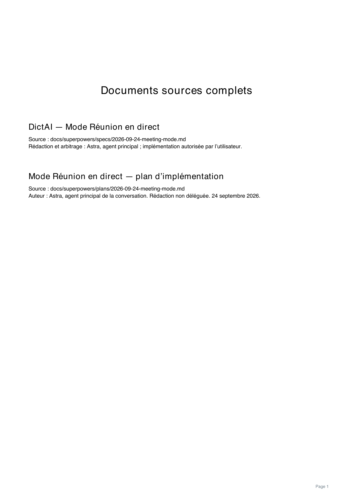

# DictAI — Mode Réunion

La spécification et le plan détaillé sont rédigés et mis à jour par Astra, l’agent principal. Luna réalise les lots de code, les tests et la conversion mécanique des documents.

- [Spécification](../../superpowers/specs/2026-09-24-meeting-mode.md)
- [Plan d’implémentation détaillé](../../superpowers/plans/2026-09-24-meeting-mode.md)
- [Résultats observés et limites](validation.md)
- [Panneau Android : douze captures inspectées](ui-renders/README.md)
- [Pastille en couronne : images et vidéo](ui-renders/pill/README.md)
- [Accueil et configuration : huit captures Android](ui-renders/activities/README.md)
- [Exports de réunion : PDF, HTML et texte vérifiés](ui-renders/exports/README.md)
- [Parcours intégré : gestes, retouches et images Android](ui-renders/integrated/README.md)
- [PDF de la spec et du plan](plan-renders/mode-reunion-spec-plan-complets.pdf)
- [Aperçus page par page](plan-renders/README.md)

Le parcours demandé est enregistré dans la spec et dans le contrat T7d.2 du plan : choix Dictée/Réunion depuis le menu ouvert vers le haut, pastille en couronne de boucles animée pendant la capture, appui pour pause/reprise, puis geste vers le bas depuis la pause pour enregistrer et terminer. Le dessin, les gestes et leur raccordement au service sont implémentés. Le test Android du moteur réel passe le démarrage, la pause, la reprise de la même session et la confirmation de fin.

Le développement se déroule dans le worktree isolé `dictai-meeting-mode/phone-whisper`. La sonde native puis le vrai pont JNI depuis l’APK isolé ont produit des mots attribués avant la fin du flux, distingué trois voix et retrouvé une voix déjà entendue. Les six tests instrumentés du pont passent. Les essais français utilisent des voix de synthèse. La qualité sur voix humaines et les performances du Poco F7 restent à mesurer.

Le choix du mode, les réglages et l’assistant sont implémentés et leurs captures Android inspectées. Les tests documentaires couvrent la restauration d’une note, les retouches, les suppressions volontaires, la copie et l’export. Les variantes normale et Réunion compilent et passent chacune **974 tests**. Les trois parcours Android intégrés réussissent : menus d’images, service avec moteur et micro réels, puis gestes avec renommage, retouche, pause/reprise, sauvegarde et nouvelle session. Les essais et leurs limites sont détaillés dans le rapport de validation.

Le plan Markdown fait référence. Le PDF contient la spec et le plan complets, y compris le complément T8b sur GitHub Actions. Les aperçus de chaque page permettent leur inspection. Le rapport de validation conserve séparément les résultats et l’historique des corrections.

La livraison utilise l’artefact GitHub Actions **dictai-meeting-test**, contenant l’APK, son empreinte et ses métadonnées. Il s’installe sous **DictAI Réunion — test**, séparément de DictAI. Les modèles se téléchargent depuis **Réglages Réunion → Télécharger les modèles Réunion** : environ 849 Mo au premier usage. Le téléchargement terminé, la reconnaissance et le suivi des voix fonctionnent localement.

Parcours prévu pour l’essai, après téléchargement des modèles :

1. Glisser vers le haut, choisir **Réunion**, puis toucher la pastille. Attendre **Écoute en cours** : la couronne de boucles tourne pendant la capture.
2. Ouvrir **Intervenants**, choisir **Personne 1**, puis **Renommer**. Le prénom remplace son étiquette dans les interventions déjà présentes et les suivantes, pour cette réunion.
3. Pour une voix à écarter, choisir **Masquer ses interventions dans cette réunion**. Le même menu permet de les réafficher. Les passages encore incertains restent visibles sous **Intervenant à confirmer** ; toucher leur étiquette permet de corriger l’attribution.
4. Retoucher directement un passage pendant que la réunion continue. Les commandes de photo, capture, copie et export se trouvent dans **Actions** ; l’ajout d’images met d’abord la capture audio en pause.
5. Toucher la pastille pour mettre en pause, puis glisser vers le bas et choisir **Enregistrer et terminer**. **Continuer la réunion** ferme le dialogue en restant en pause ; un nouvel appui reprend l’écoute.

La note conserve les noms, les retouches et les images, sans fichier audio. Les profils sont propres à la réunion : un nouvel enregistrement crée une nouvelle session. Cette version reste expérimentale jusqu’à l’essai sur le Poco F7, notamment pour la qualité des voix humaines et les réunions longues.

