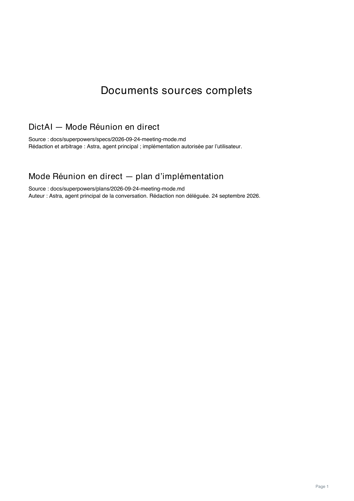

# DictAI — Mode Réunion

La spécification et le plan détaillé sont rédigés et mis à jour par Astra, l’agent principal. Luna réalise les lots de code, les tests et la conversion mécanique des documents.

Le prototype **test4** utilise Nemotron 3.5 Handy Q8 pour la transcription et un moteur indépendant pour identifier les voix. Le texte apparaît sans attendre cette identification ; les attributions complètent ensuite les passages existants. Les continuations rapprochées d’une même personne sont présentées ensemble, avec des repères relatifs à l’audio quand l’alignement est disponible.

- [Architecture Handy et contrats](../../superpowers/specs/2026-09-27-meeting-handy-live.md)
- [Plan de correction de la conversation](../../superpowers/plans/2026-09-27-meeting-conversation-flow.md)
- [Mesures test4, validation et limites](2026-09-27-handy-conversation-validation.md)
- [Captures Android test4 et provenance](ui-renders/handy-test4/README.md)
- [Deux revues finales du prototype](handy-test4-evidence/reviews.md)

Le test intégré court conserve toutes les paroles lors des révisions de voix. **Le test prolongé de diarisation échoue à suivre le débit sur l’émulateur** : test4 reste une version expérimentale à mesurer sur Poco F7. Les tests automatisés ne garantissent ni un délai inférieur à une seconde sur le téléphone, ni l’identification correcte de toutes les voix humaines.

Les liens suivants conservent la documentation et les preuves des versions initiales :

- [Spécification](../../superpowers/specs/2026-09-24-meeting-mode.md)
- [Plan d’implémentation détaillé](../../superpowers/plans/2026-09-24-meeting-mode.md)
- [Résultats observés et limites](validation.md)
- [Panneau Android : douze captures inspectées](ui-renders/README.md)
- [Pastille en couronne : images et vidéo](ui-renders/pill/README.md)
- [Accueil et configuration : huit captures Android](ui-renders/activities/README.md)
- [Exports de réunion : PDF, HTML et texte vérifiés](ui-renders/exports/README.md)
- [Parcours intégré : gestes, retouches et images Android](ui-renders/integrated/README.md)
- [PDF de la spec et du plan](plan-renders/mode-reunion-spec-plan-complets.pdf)
- [Aperçus page par page](plan-renders/README.md)

Le parcours demandé est enregistré dans la spec et dans le contrat T7d.2 du plan : choix Dictée/Réunion depuis le menu ouvert vers le haut, pastille en couronne de boucles animée pendant la capture, appui pour pause/reprise, puis geste vers le bas depuis la pause pour enregistrer et terminer. Le dessin, les gestes et leur raccordement au service sont implémentés. Le test Android du moteur réel passe le démarrage, la pause, la reprise de la même session et la confirmation de fin.

Le développement se déroule dans le worktree isolé `dictai-meeting-mode/phone-whisper`. Les premières preuves du pont NeMo concernent le moteur des versions antérieures. Les essais français utilisent des voix de synthèse ; leur réussite ne constitue pas une validation de conversation humaine.

La validation initiale du 25 septembre comptait 974 tests par variante et trois parcours Android intégrés. Les résultats de test4 sont consignés dans son rapport distinct, lié ci-dessus. Les tests documentaires couvrent notamment la restauration d’une note, les retouches, les suppressions volontaires, la copie et l’export.

Le plan Markdown fait référence. Le PDF et ses aperçus correspondent à la spécification initiale ; l’architecture Handy est décrite dans les documents du 27 septembre.

La livraison utilise l’artefact GitHub Actions **dictai-meeting-test**, contenant l’APK, son empreinte et ses métadonnées ; le rapport test4 identifie l’exécution vérifiée. Il s’installe sous **DictAI Réunion — test**, séparément de DictAI. Dans test4, utiliser **Réglages Réunion → Préparer les modèles Réunion**. Le paquet Handy + voix occupe 858 106 368 octets, affichés « Jusqu’à 859 Mo ». Les fichiers privés compatibles déjà présents dans cette application sont réutilisés après vérification ; les fichiers manquants sont téléchargés. L’ancien paquet ASR NeMo ne remplace pas Handy. Une fois les modèles prêts, les calculs sont effectués localement ; cela ne garantit pas qu’ils suivent le débit d’une longue conversation.

Parcours prévu pour l’essai, après téléchargement des modèles :

1. Glisser vers le haut, choisir **Réunion**, puis toucher la pastille. Attendre **Écoute en cours** : la couronne de boucles tourne pendant la capture.
2. Ouvrir **Intervenants**, choisir **Personne 1**, puis **Renommer**. Le prénom remplace son étiquette dans les interventions déjà présentes et les suivantes, pour cette réunion.
3. Pour une voix à écarter, choisir **Masquer ses interventions dans cette réunion**. Le même menu permet de les réafficher. Les passages encore incertains restent visibles sous **Intervenant à confirmer** ; toucher leur étiquette permet de corriger l’attribution.
4. Retoucher directement un passage pendant que la réunion continue. Les commandes de photo, capture, copie et export se trouvent dans **Actions** ; l’ajout d’images met d’abord la capture audio en pause.
5. Toucher la pastille pour mettre en pause, puis glisser vers le bas et choisir **Enregistrer et terminer**. **Continuer la réunion** ferme le dialogue en restant en pause ; un nouvel appui reprend l’écoute.
6. Glisser la pastille vers la droite pour annuler, y compris si la finalisation prend du retard. Dans un dossier de notes, le geste vers la droite ramène à la liste des dossiers.

La note conserve les noms, les retouches et les images, sans fichier audio. Les profils sont propres à la réunion : un nouvel enregistrement crée une nouvelle session. Cette version reste expérimentale jusqu’à l’essai sur le Poco F7, notamment pour la qualité des voix humaines et les réunions longues.

