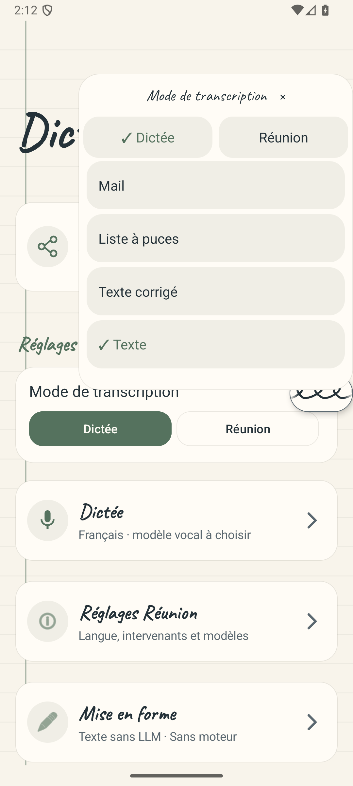
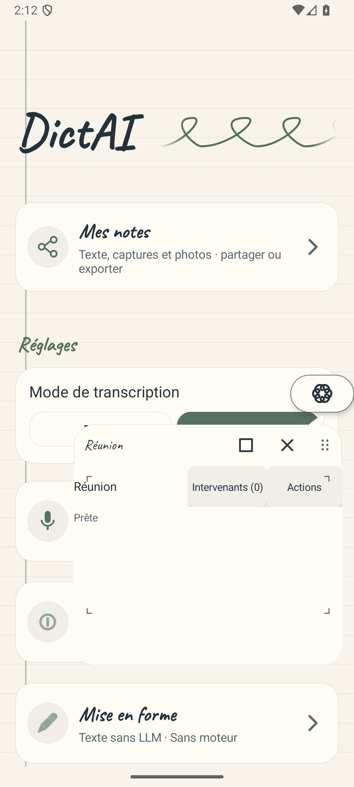

# Correctif Réunion : menu et disponibilité des modèles

Date : 26 septembre 2026. Conception et revues : Astra XHigh. Implémentation et exécution : Luna 6 Max.

Plan conservé : [plan correctif](../../superpowers/plans/2026-09-25-meeting-mode-gesture-readiness-fix.md), avec [aperçu paginé](corrective-renders/README.md).

## Défauts reproduits et corrections

| Parcours | Échec observé avant correction | Comportement corrigé |
| --- | --- | --- |
| Glissement vers le haut depuis Dictée, plusieurs mouvements puis relâchement | Le format passait de `cleanup` à `list` et le menu se fermait. | Le menu reste ouvert et touchable. Le mode et le format changent uniquement par un toucher explicite. |
| Démarrage pendant une nouvelle vérification des modèles | Le vrai magasin était en `Checking`, mais le panneau affichait « Modèle indisponible ». | Panneau et pastille suivent la disponibilité actuelle, puis reviennent à « Prêt ». Un nouvel appui explicite est nécessaire pour démarrer. |

Les fichiers des modèles, leur validation et le moteur natif restent inchangés. Le callback du magasin relit l’état courant du contrôleur et du magasin au moment du rendu, afin de ne pas appliquer un instantané déjà dépassé.

Les phases d’erreur du moteur, d’écoute, de fermeture et de réunion restaurée gardent leurs protections. La correction regroupe les deux phases précédant le démarrage dans la projection existante de disponibilité ; elle ne crée pas une nouvelle machine d’états.

## Vérifications locales

| Vérification | Résultat constaté |
| --- | --- |
| Gestes, test du vrai listener de la pastille | RED : un échec attendu sur la sélection involontaire. GREEN : 7 tests, aucun échec ni erreur. Retour Réunion → Dictée par geste et choix d’un format par toucher couverts. |
| Disponibilité, vrai `MeetingModelStore` et listener du service | RED : « Modèle indisponible » au lieu du chargement. GREEN : passage `Checking` → `Ready`, zéro réservation ou ouverture du micro automatique, puis une seule réservation après le nouvel appui. |
| Variante normale : tests complets et `assembleDebug` | 976 tests, aucun échec, erreur ou test ignoré ; compilation réussie. |
| Variante Réunion : tests complets, `assembleDebug`, `assembleDebugAndroidTest` | 976 tests, aucun échec, erreur ou test ignoré ; les deux APK sont produits. |
| Identité normale après ajout du contrôle de version | Test ciblé rejoué : 1 test réussi. |
| Vérificateur de l’APK de test | 9 tests Python réussis ; ancienne identité refusée, nouvelle identité acceptée. |
| Espaces et patch | `git diff --check` réussi. |

Les suites existantes couvrent notamment les documents restaurés qui ne relancent pas l’ASR, les modèles absents ou en téléchargement qui ne déclenchent pas de démarrage différé, et les erreurs natives qui arrêtent la capture. La validation du démarrage réel du micro relève du test Android ci-dessous ; le test JVM de disponibilité s’arrête à l’admission de ce démarrage.

Deux essais de la nouvelle fixture JVM ont été interrompus parce que le drainage de la boucle Android simulée ne se terminait pas pendant l’animation. La fixture a été bornée à son contrat de disponibilité et d’admission, sans changement de production destiné à contourner cette animation. Un ancien test d’identité attendait aussi le suffixe précédent : son attente a été actualisée, puis les contrôles concernés ont été rejoués.

Archives locales : `app/build/reports/meeting/gesture-menu-green-1/`, `app/build/reports/meeting/gesture-readiness-final/`, `app/build/reports/meeting/identity-green.log`. Elles sont des preuves de travail locales, hors APK.

## Instantané des sources revues

| Fichier | SHA-256 |
| --- | --- |
| `OverlayService.kt` | `a287cd7c8437db7191c3e63d8706cff27431e69450c8d71d9f3da5ac8d115644` |
| `OverlayServiceGestureRobolectricTest.kt` | `e94beb0291435728e64cbdd23b959462e4014549b92a5cba55d9efe82c493e7a` |
| `OverlayServiceMeetingReadinessRobolectricTest.kt` | `fd5cae71370e1b460d25f47a56917b50ced647129d0c2237f4d661719bacae33` |
| `MeetingOverlayDefaultRuntimeAndroidTest.kt` | `9a6e76526d1551002018355ad18f0684016d89c58f2b507c4359e03a5ad6d4ce` |
| `MeetingPrototypeIdentityTest.kt` | `2e46a6aa94df4273160c9dafe5b2f1d1e6195dc8eb8e31b0b6768fd536fde474` |
| `app/build.gradle.kts` | `c64cdb01390133afba4d390035598626243c03a611e1bfa970f75d54a376aa52` |
| `scripts/prepare_meeting_ci_apk.py` | `66a985fedbbe6dc7c71732665ef43a28c7249ee89000699f7a24d16361a925a3` |
| `scripts/test_prepare_meeting_ci_apk.py` | `2035213b0b0c2d22c8406156c12c79398f2abdfe2a8830efd4095fe7b1e94395` |

## Parcours Android

Le test `defaultServiceRecordsPausesResumesAndSafelyFinishesWithPinnedModels` a réussi sur l’émulateur Android API 36 : **1 test réussi en 52,81 secondes**. Le runner, son manifeste et ses captures sont archivés dans `app/build/reports/meeting/gesture-readiness-final/android-smoke/default-runtime/`.

Le parcours utilise le vrai moteur JNI, les modèles épinglés et `AudioRecord`. Il part du mode Dictée, injecte un glissement avec plusieurs mouvements, vérifie le menu après relâchement, touche la ligne Réunion de l’overlay, puis lance la capture en touchant la pastille, une fois le panneau prêt. Il vérifie ensuite l’écoute en arrière-plan, la pause, la reprise, la fin et la libération du moteur et du lecteur audio. Les coordonnées du toucher sont calculées dans l’espace écran ; la distinction avec l’espace de la racine d’une fenêtre est documentée par [Android View](https://developer.android.com/reference/android/view/View#getLocationOnScreen(int[])).

Les deux modèles ont été placés dans une génération privée de test après vérification de leur taille et de leur SHA-256. Le test ne conserve aucun audio et retire sa génération et son brouillon. Aucun téléphone physique n’était connecté : ce résultat ne valide ni la précision de la diarisation en réunion, ni les performances sur le Poco F7.

Captures synthétiques issues du test, inspectées visuellement par Astra : les commandes restent lisibles et accessibles, le menu est ouvert après relâchement et le panneau affiche « Prête » avant tout démarrage du micro.

## Revues Astra et arbitrage

Deux passes distinctes portent sur les huit sources dont les empreintes figurent ci-dessus.

1. **Conformité, UX et sécurité : favorable.** Le relâchement ouvre un menu touchable sans sélectionner de format ; le choix de mode passe par un toucher explicite. La disponibilité affichée reflète les fichiers vérifiés. La transition vers « Prête » ne démarre jamais le micro. Le test Android confirme le parcours sur les véritables fenêtres et le moteur natif.
2. **Régressions et maintenabilité : favorable.** Les branches d’annulation et de déplacement de la pastille sont conservées. Les erreurs natives, les documents restaurés, la capture et la fermeture restent traités séparément. Le callback relit l’état courant au lieu de réappliquer un événement périmé. La correction réutilise les projections existantes, sans ajouter de machine d’états. Les suites normales et Réunion sont vertes ; les contrôles d’identité refusent l’ancien numéro de version.

**Arbitrage : publication du correctif autorisée sur la branche de test.** Aucun changement de poids, de catalogue ou de bibliothèque native n’est inclus. La validation physique reste à effectuer après installation.

## Livraison

L’identité de la mise à jour est `com.uhama.whisperpin.meetingtest`, version `0.9.6-dictai-meeting-test2`, code `36`. Le package reste celui du prototype précédent pour conserver ses données et modèles lors d’une mise à jour signée avec la même clé.

Au moment de ce commit, la fabrication GitHub Actions reste à exécuter. La livraison exige une exécution réussie, le téléchargement de son artefact, puis la vérification de l’identité, de la signature, des 13 bibliothèques natives, de leur alignement et du SHA-256 de l’APK. L’APK local utilisé pour l’instrumentation n’est pas le livrable final.
