# Panneau Réunion — captures Android

Captures inspectées par Astra le 24 septembre 2026. Il s’agit du panneau Android réel, hébergé dans une fixture utilisant des données simulées. Le micro et les modèles ne sont pas utilisés dans ces scènes. La pastille en spirale et son raccordement aux gestes ne figurent pas encore dans ces images.

Le second passage de la fixture est terminé avec succès : un test instrumenté, 11,285 secondes. Les 13 tests JVM du panneau et 20 tests médias ciblés passent également. Les prénoms longs, homonymes, pièces jointes conservées après filtre et thèmes sont lisibles. Le panneau compact conserve deux lignes à taille normale ; avec une police agrandie, le défilement et l’agrandissement permettent de poursuivre la lecture. La capture du clavier montre son ouverture, sans valider à elle seule une correction pendant une vraie transcription.

La première série était masquée par une alerte System UI de l’émulateur ; elle n’est pas utilisée pour cet audit. Les détails et empreintes figurent dans le [rapport de validation](../validation.md). Le [plan](../../../superpowers/plans/2026-09-24-meeting-mode.md) décrit les essais applicatifs qui restent à effectuer.

## Trois profils et retour d’un intervenant

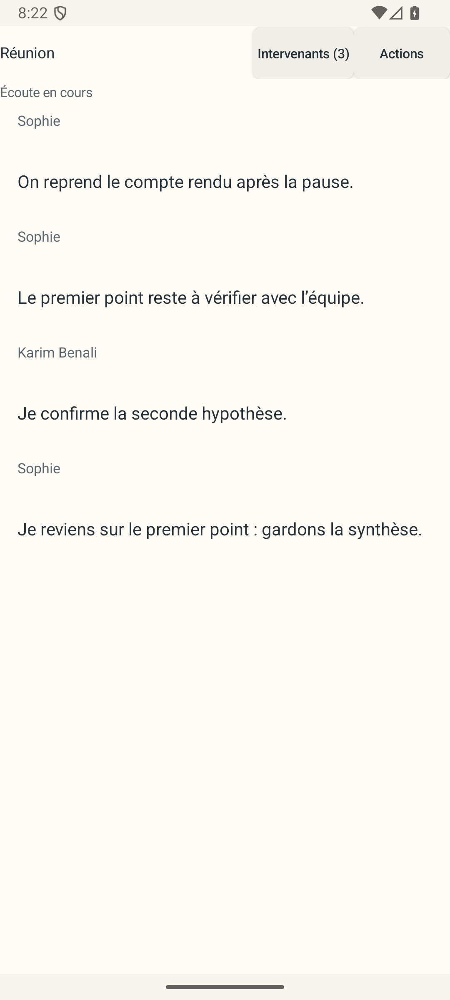

## Deux personnes portant le prénom Sophie restent distinctes dans le sélecteur

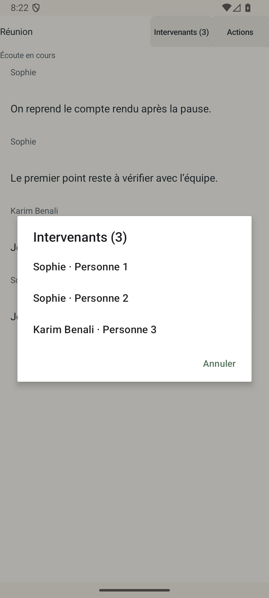

## Saisie d’un nom long

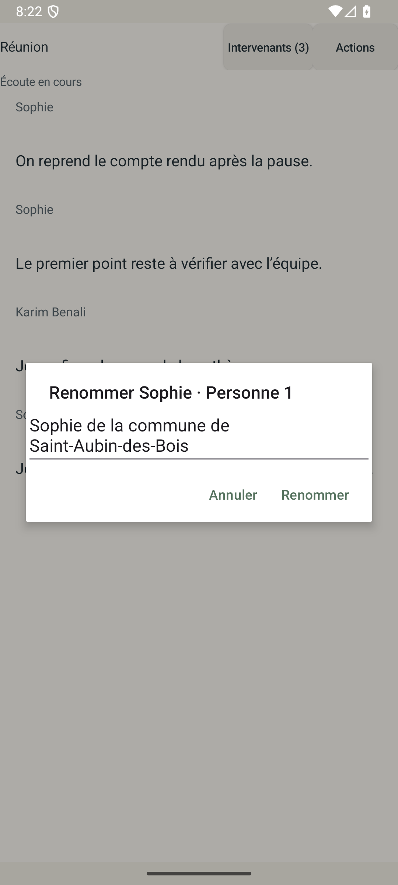

## Nom actualisé sur les passages concernés

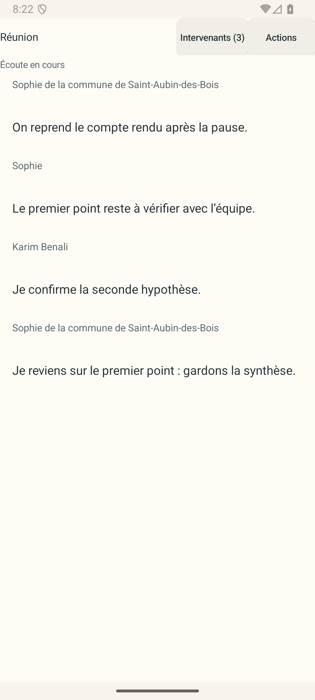

## Paroles masquées et pièce jointe toujours accessible

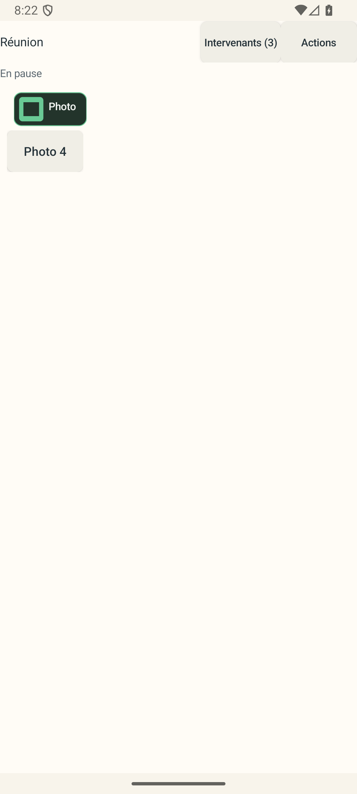

## Ouverture du clavier sur un passage éditable

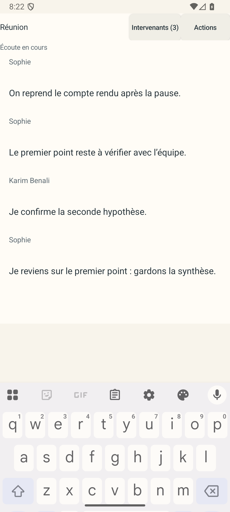

## Écoute affichée et erreur de sauvegarde distincte

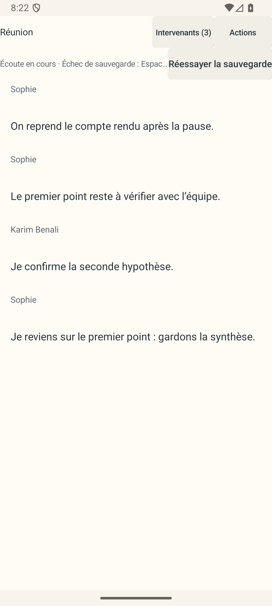

## Progression et annulation du téléchargement

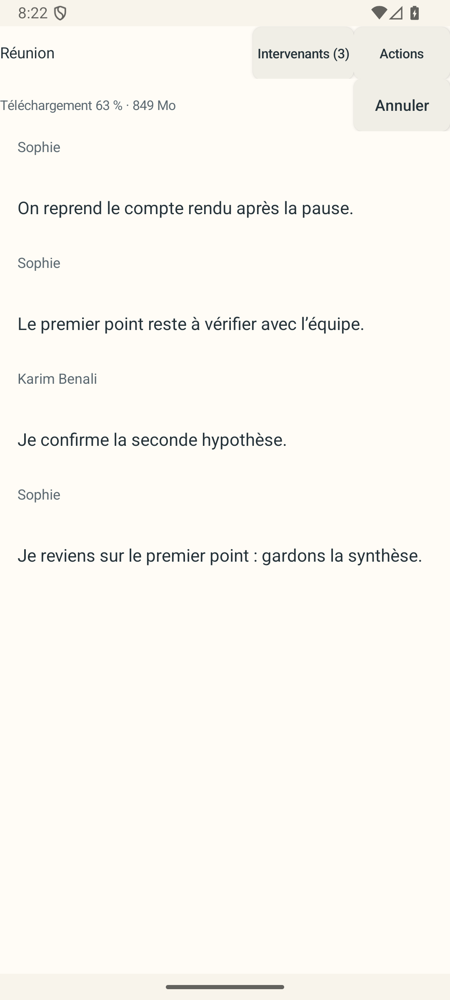

## Thème clair

## Thème sombre

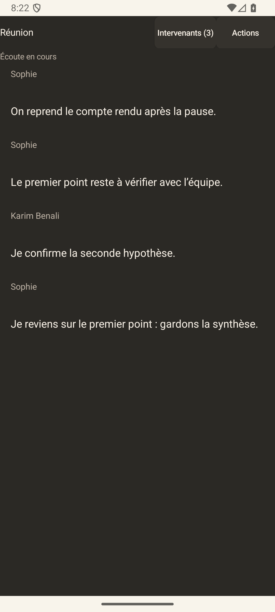

## Panneau de 240 × 112 dp, taille de texte normale

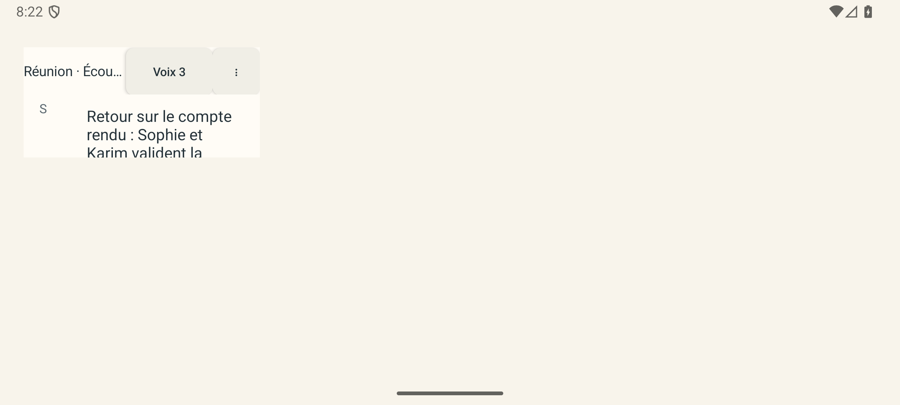

## Même panneau avec taille de texte agrandie

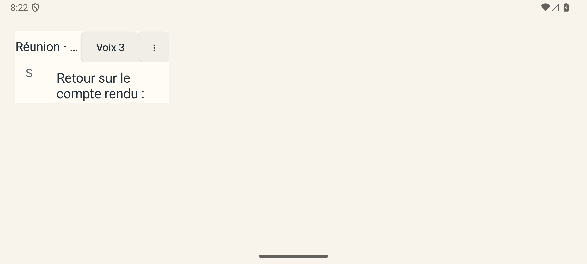

## Couronne Réunion

Vue Android réelle : pastille 74 × 44 dp en haut, aperçu agrandi en dessous. La [série complète et sa vidéo](pill/README.md) ont maintenant été inspectées par Astra : repos, rotation, pause et retour à l’onde Dictée. L’écoute est simulée, sans audio ni modèle. Les six boucles sont décoratives et ne représentent pas le nombre d’intervenants.

## Accueil et configuration

Les [huit captures des vraies Activities](activities/README.md), inspectées le 25 septembre, montrent le choix Dictée/Réunion, les réglages et l’assistant dans les deux thèmes, avec deux vues à texte agrandi. Cette série utilise des modèles absents et ne démarre pas d’enregistrement.

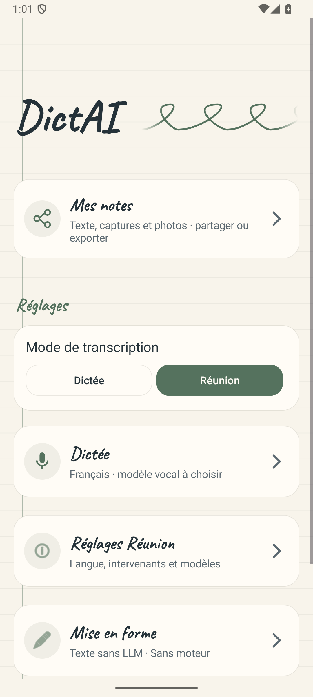
