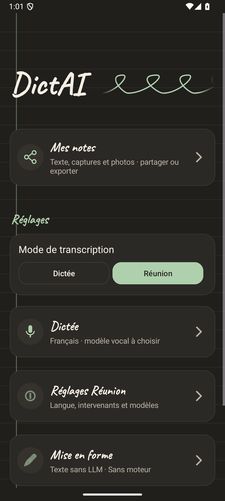
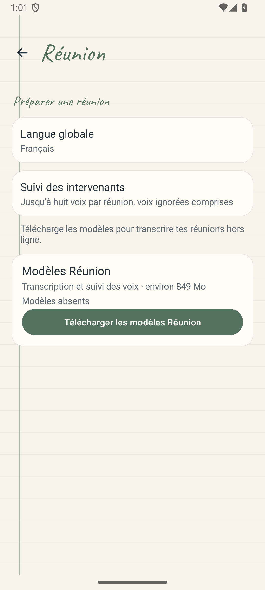
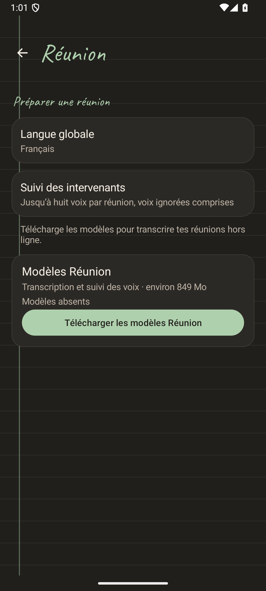
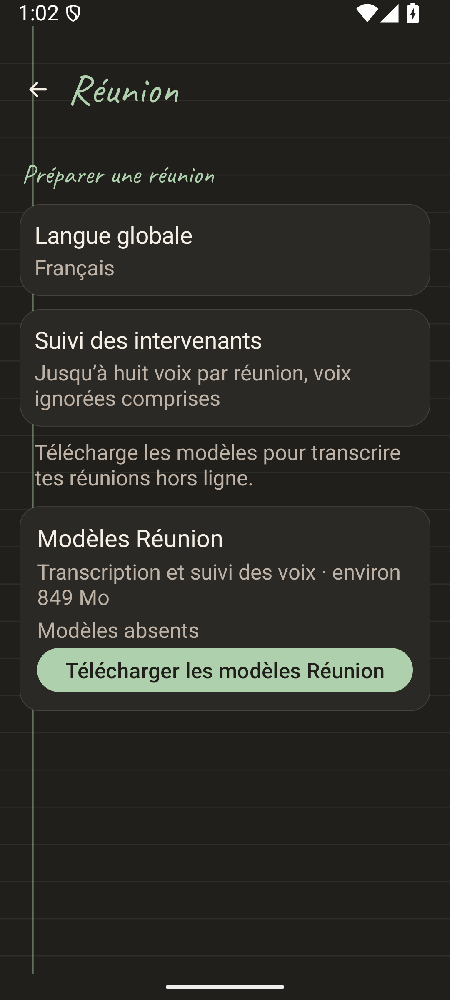
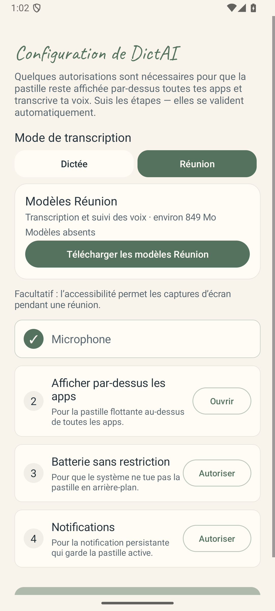
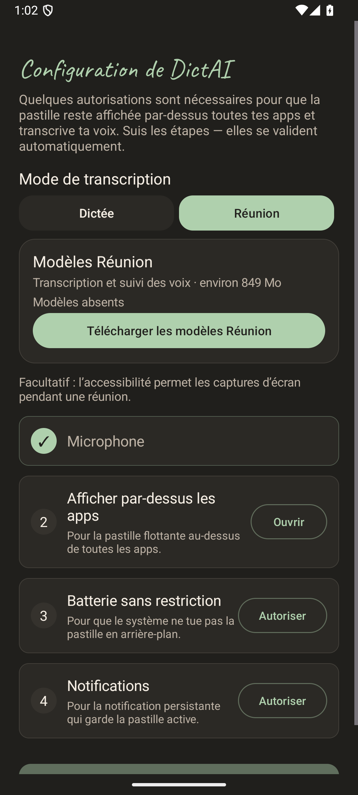
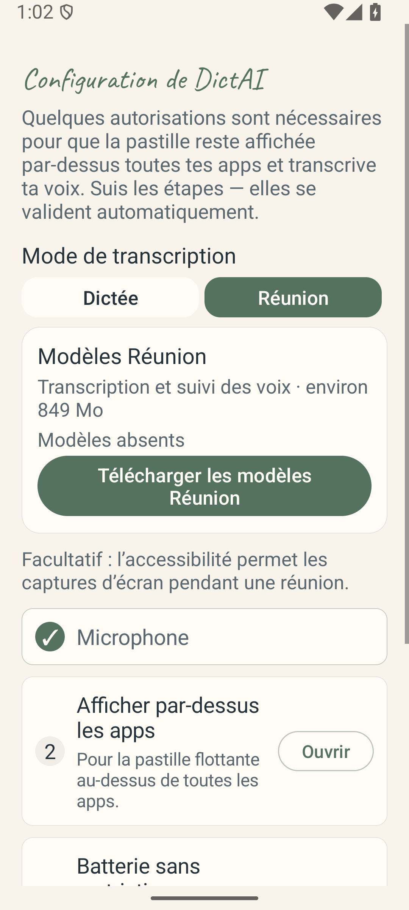

# Mode Réunion — écrans Android

Astra a inspecté les huit captures ci-dessous le 25 septembre 2026. Il s’agit des vraies Activities du prototype Android : accueil, réglages Réunion et assistant de configuration. Les modèles sont volontairement absents ; aucun téléchargement ni enregistrement audio n’est déclenché par cette fixture.

Le choix Réunion reste lisible dans les deux thèmes. Les cartes, textes et boutons ne se chevauchent pas. Avec le texte agrandi à 135 %, les paragraphes et le bouton de téléchargement passent sur plusieurs lignes ; les écrans restent défilables. Les captures agrandies montrent une portion de leur contenu, pas la totalité de la page.

## Accueil

| Thème clair | Thème sombre |
| --- | --- |
|  |  |

## Réglages Réunion

| Thème clair | Thème sombre |
| --- | --- |
|  |  |

## Assistant de configuration

| Thème clair | Thème sombre |
| --- | --- |
|  |  |

## Preuves et limites

La troisième tentative réussit : un test en 21,512 secondes sur Medium_Phone_API_36.0, Android 16, arm64. La première tentative révélait un défaut d’application du facteur de police dans la fixture ; la deuxième manquait une transition de vérification des modèles à cause d’un observateur attaché trop tard. Ces tentatives restent archivées. La troisième applique réellement le réglage système et vérifie le facteur reçu par chaque Activity ; elle observe la vérification avant l’ouverture du panneau.

- [Empreintes des huit PNG](attempt-3/documented-png-sha256.txt).
- État après restauration : microphone refusé et facteur de police 1.0. Les journaux complets restent dans les preuves locales.
- APK app réutilisé : `8ee1f290156a53df5e9b7be8008426431774899e4b65ce9a4b69fb28b30d1197`.
- APK de test reconstruit sous JBR 21 : `b261d12d57eee85affa138c2b34e6bca13e866b0f2daeab6ba5ac8240b5650ef`.

Le micro est accordé extérieurement pour éviter la boîte de permission de l’accueil, puis révoqué après la sortie du runner. La fixture interdit les requêtes réseau et n’ouvre aucun moteur audio. Cette validation visuelle ne prouve pas encore les gestes de la pastille ni une réunion complète dans OverlayService.

Un test AudioRecord distinct a réussi sur le même émulateur : deux cycles de capture/arrêt, trois blocs et 9 600 octets par cycle, mono 16 kHz PCM16. Les échantillons sont jetés ; aucune parole ni absence de silence n’est vérifiée. Il valide l’adaptateur Android avec Activity visible, pas le service microphone en arrière-plan ni les performances sur Poco F7. Les mesures et la restauration de permission sont conservées dans les preuves locales.
