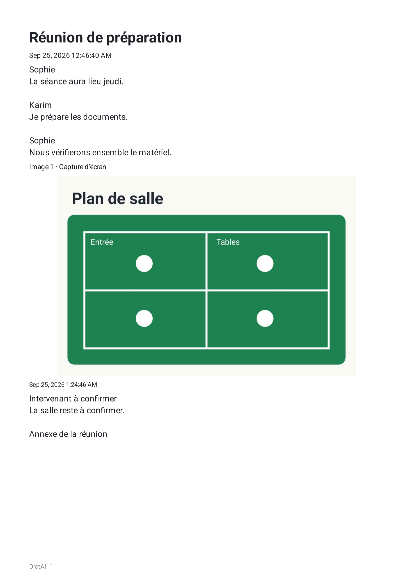
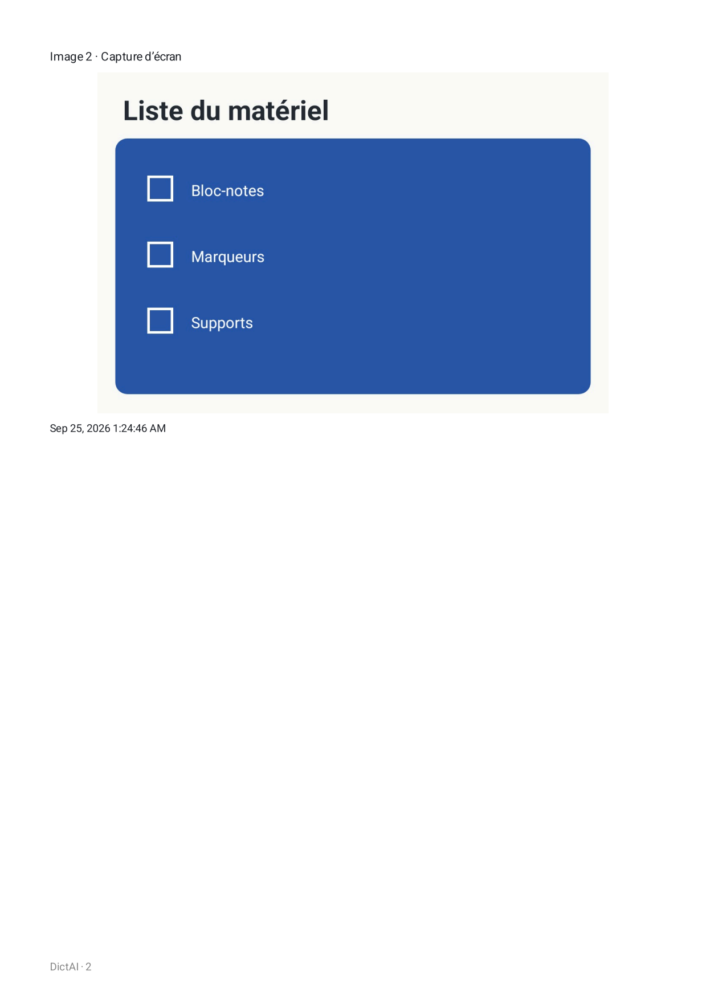
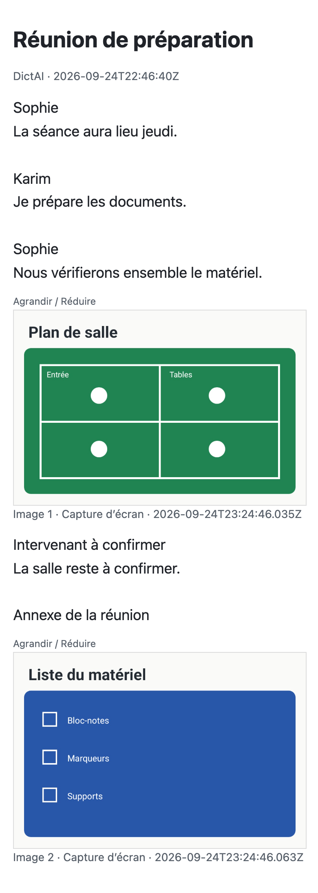
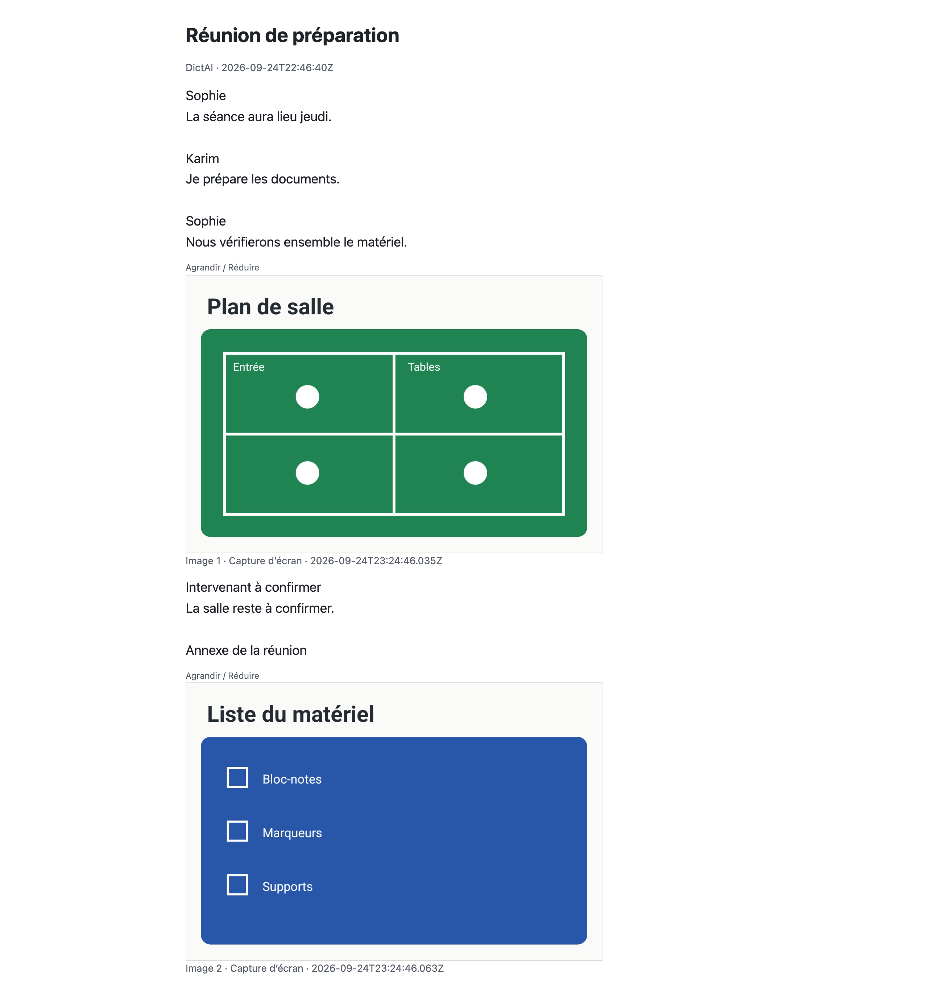

# Réunion — exports vérifiés

Astra a inspecté les deux pages du PDF Android et les trois captures du HTML le 25 septembre 2026. Le scénario est synthétique : Sophie, Karim, une correction de « mardi » en « jeudi », une troisième voix ignorée, un passage à confirmer et deux images.

Le texte partagé correspond exactement à l’attente indépendante. Le PDF et le HTML conservent les bons prénoms, « jeudi » et les deux images, dont celle rattachée à la voix ignorée. L’ancien cache texte et les paroles masquées ne réapparaissent pas.

## Fichiers exportés

- [PDF Android, deux pages A4](meeting-note-f5eb72e8/artifacts/meeting-note-f5eb72e8-1eb5-41a8-a3fb-a43a916ed5e7/meeting-note.pdf)
- [HTML autonome](meeting-note-f5eb72e8/artifacts/meeting-note-f5eb72e8-1eb5-41a8-a3fb-a43a916ed5e7/meeting-note.html)
- [Texte partagé](meeting-note-f5eb72e8/artifacts/meeting-note-f5eb72e8-1eb5-41a8-a3fb-a43a916ed5e7/meeting-share.txt)
- [Texte attendu](meeting-note-f5eb72e8/artifacts/meeting-note-f5eb72e8-1eb5-41a8-a3fb-a43a916ed5e7/meeting-share-expected.txt)
- [Texte extrait du PDF](meeting-note-f5eb72e8/artifacts/meeting-note-f5eb72e8-1eb5-41a8-a3fb-a43a916ed5e7/pdftotext.txt)

## PDF Android

Les images sont entières et dans l’ordre ; les textes, marges et pieds de page sont lisibles. Rendu Android PdfRenderer à 150 dpi, 1 239 × 1 754 pixels par page. Les dates anglaises reflètent la langue de l’émulateur.

## HTML sur mobile et grand écran

Le rendu réel à 390 et 1 280 pixels CSS, avec une densité de 2, ne présente ni chevauchement ni débordement horizontal. Les deux images intégrées sont décodées. Le clic Agrandir/Réduire ouvre puis referme le détail. À 390 pixels, l’image occupe déjà toute la largeur disponible ; à 1 280 pixels, elle passe de 575 à 770 pixels CSS avant de revenir à sa taille initiale.

## Preuves

Le runner Android réussit un test en 1,030 seconde sur le prototype, Android 16/API 36 arm64, sans modèle ni audio. Le rendu HTML utilise Playwright avec Chrome 153 installé, en headless et dans deux contextes isolés hors ligne. Aucune requête HTTP(S), erreur console ou erreur de page n’est observée ; aucun navigateur supplémentaire n’a été téléchargé.

- [Vérifications d’export](meeting-note-f5eb72e8/export-verification.txt), [empreintes](meeting-note-f5eb72e8/SHA256SUMS.txt). Les journaux Android complets sont conservés localement.
- [Rapport du navigateur](meeting-note-f5eb72e8/browser-audit/browser-audit.json), [console et réseau](meeting-note-f5eb72e8/browser-audit/console-and-network.txt).
- PDF : 243 347 octets, SHA-256 `4d0a5013ad0148b9384ee9e2949b2ce2a7a8e86339156a9c64fd69643a6ee1b2`.
- HTML : 122 334 octets, SHA-256 `1e5be59b2a1344083de682e9a1ce9756c7eb16faa3a179d4332008abf72a5104`.
- TXT et attente : 385 octets chacun, SHA-256 `9143525c383c94ee5f558657368f2622002a4f0f258506c83f6f69736732a264`.

Ce scénario vérifie la projection et l’export d’une note structurée. La création de cette note par les gestes, le micro et la reconnaissance relève des essais d’intégration du service.
