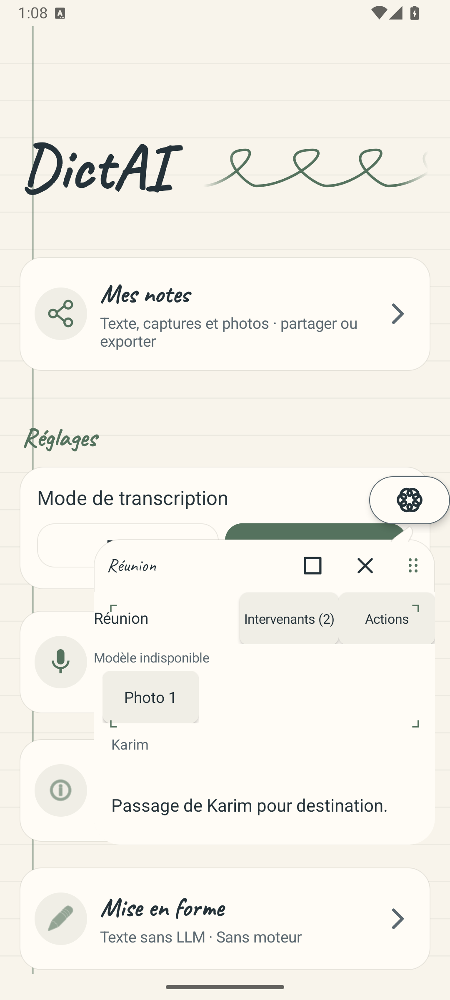
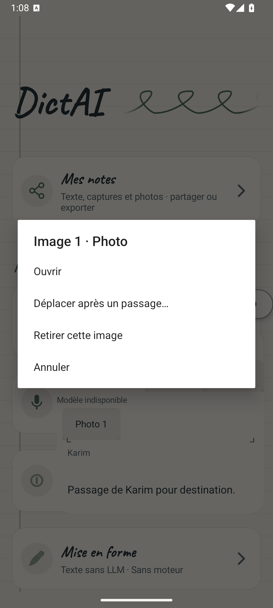
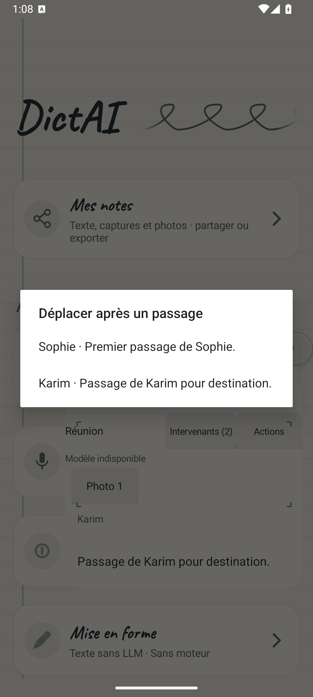
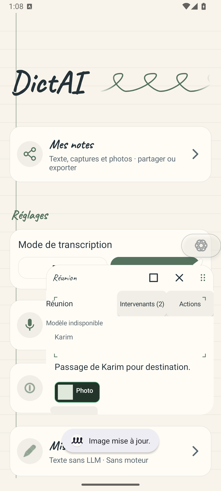
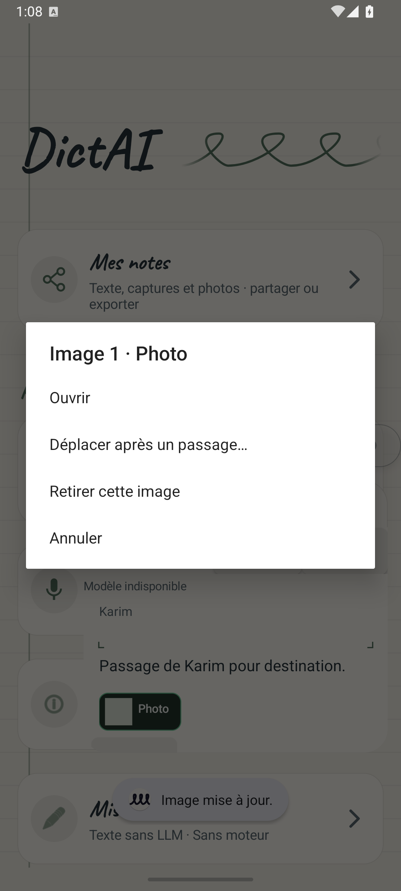
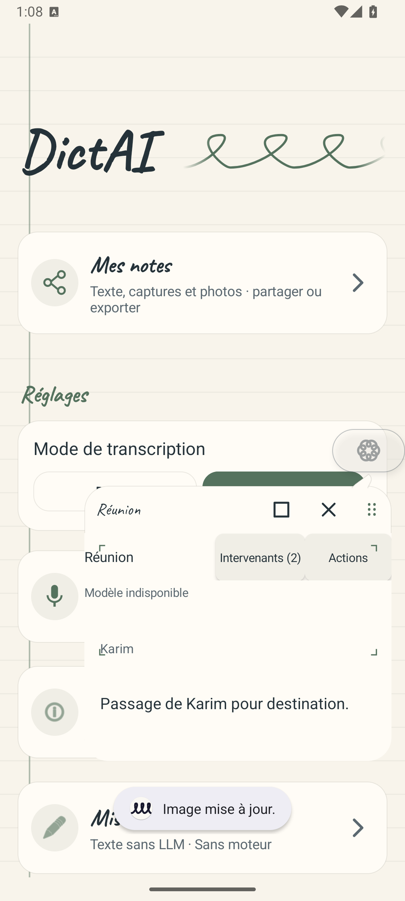
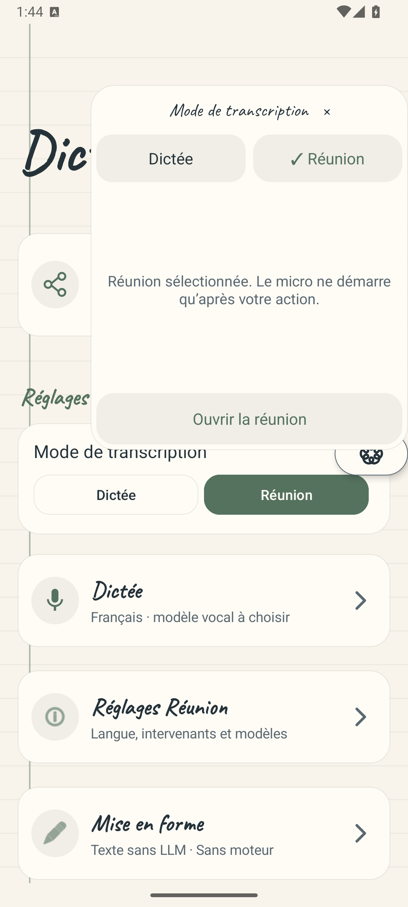
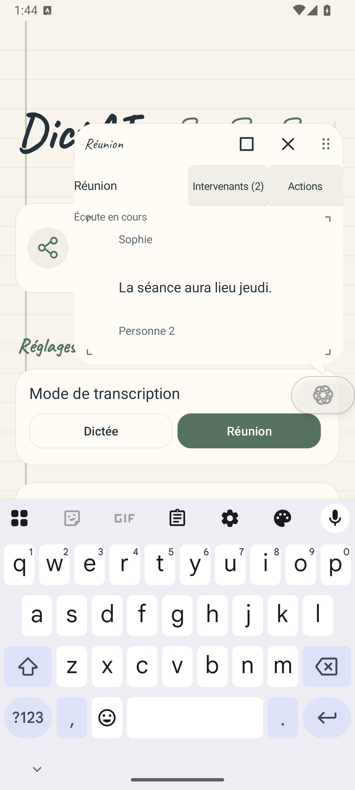
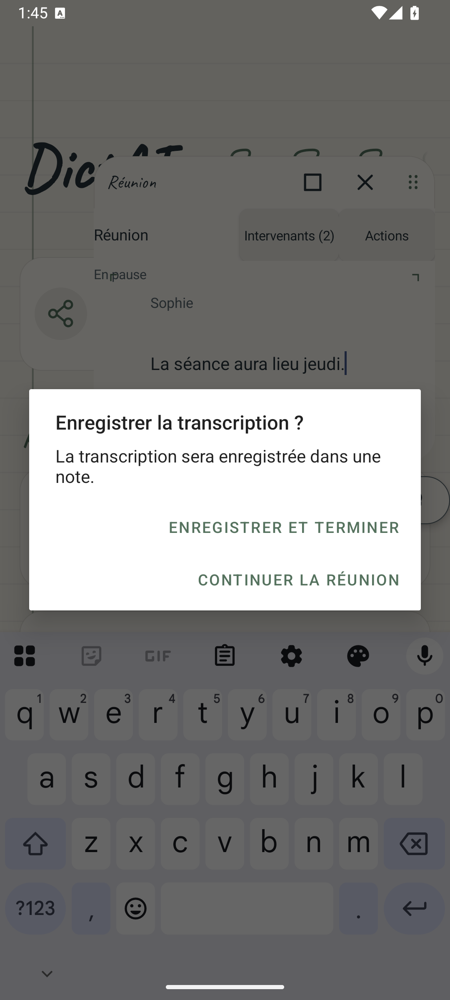
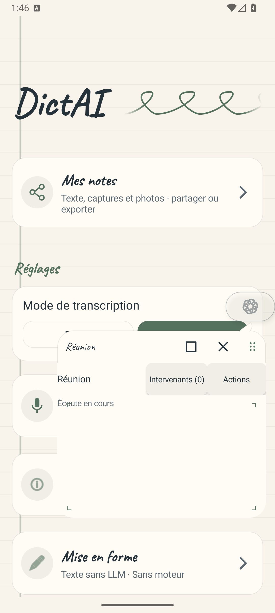

# Parcours Android intégré

Captures de l’application native sur l’émulateur Android API 36 arm64, le 25 septembre 2026. L’APK Réunion isolé a pour SHA-256 `c8f20dc3e07b00e5223f6b3636645657b0e813ebd4e9a6f78f89eaf312004670`.

## Déplacement et retrait d’une image

`MeetingOverlayImageMenusAndroidTest` réussit : un test en 9,211 secondes. La fixture ouvre une note structurée synthétique dans le vrai service, actionne ses menus, vérifie la sauvegarde après déplacement, puis le retrait de l’image et de ses fichiers. Aucun modèle ni microphone n’est ouvert. Le message « Modèle indisponible » est attendu dans cet essai documentaire : la note reste modifiable sans les modèles.

Les six captures ont été inspectées par Astra : commandes lisibles, destinations nommées, image placée après le passage de Karim puis retirée. La note est défilée dans un panneau compact ; tous ses passages ne sont donc pas visibles simultanément. Le carré clair représente l’image synthétique de cet essai.

### Note avant déplacement

### Menu de l’image

### Choix du passage de destination

### Image déplacée après Karim

### Commande de retrait

### Note après retrait

## Gestes, renommage, retouche et sauvegarde

`MeetingOverlayGesturesAndroidTest` réussit : un test en 136,511 secondes. Il utilise les fenêtres, les gestes, le service, le contrôleur, l’éditeur et la sauvegarde réels. Les événements de reconnaissance et le microphone sont simulés pour reproduire exactement les changements de voix et les révisions tardives.

Le scénario renomme Personne 1 en Sophie et remplace « mardi » par « jeudi ». Une nouvelle transcription contenant « mardi matin » ne remplace pas cette retouche. La pause et la reprise conservent la session et les profils ; la confirmation enregistre la note, puis un nouvel appui démarre une réunion avec des profils vides. L’état durable de la note est contrôlé, en complément des captures.

Astra a inspecté les cinq images de ce passage réussi : prénom et correction lisibles, état de pause et choix de confirmation explicites, note terminée puis nouvelle session vide. Le clavier reste visible sur certaines captures parce que le panneau permet l’édition du texte. Cet essai ne mesure pas la qualité de reconnaissance des voix humaines.

### Menu sans démarrage du microphone

### Sophie et la correction conservée

### Confirmation depuis la pause

### Note terminée

### Nouvelle réunion sans anciens profils

