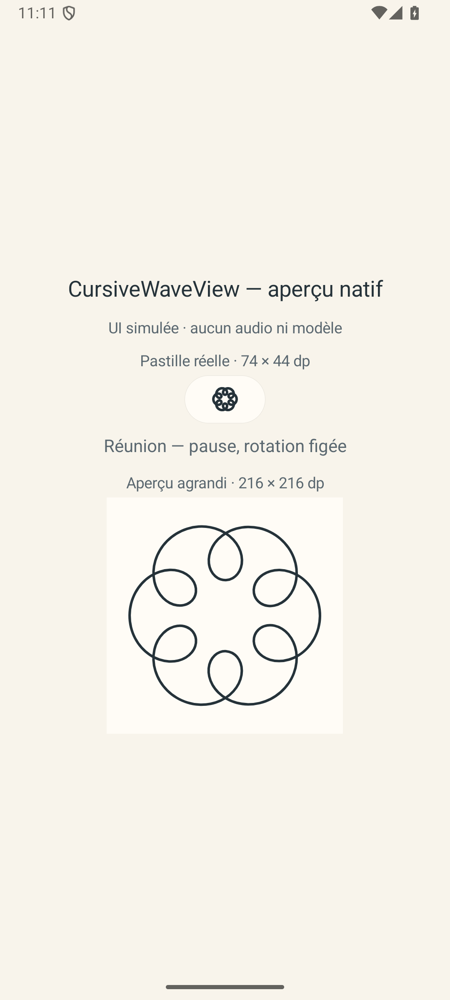
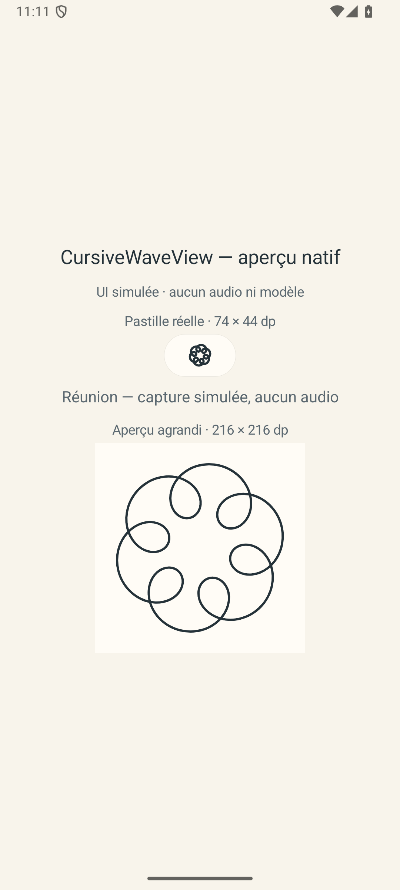
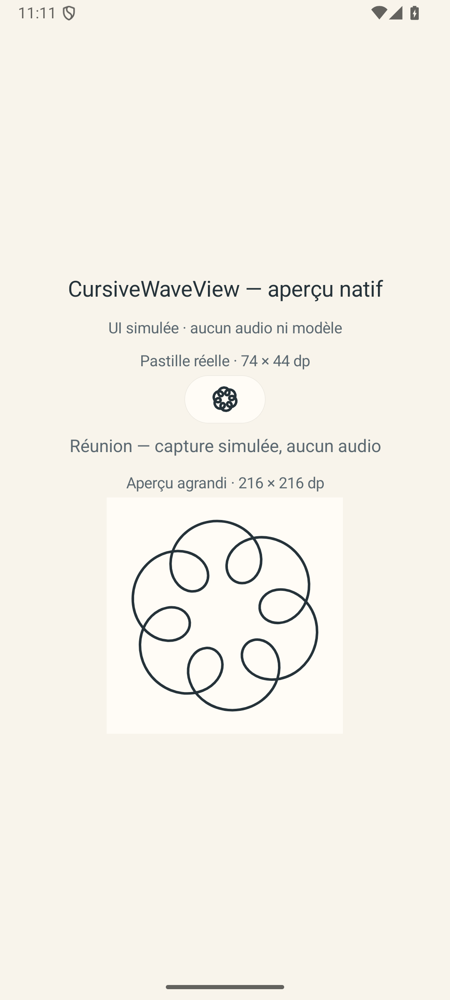
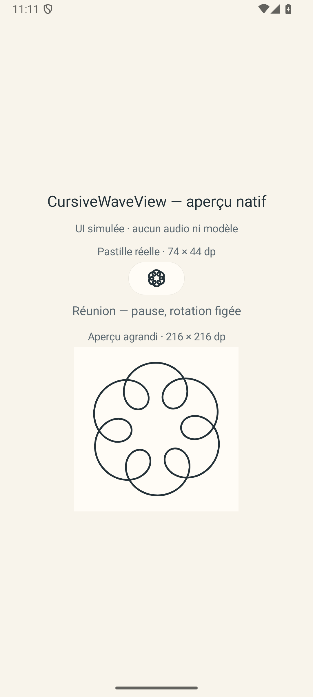
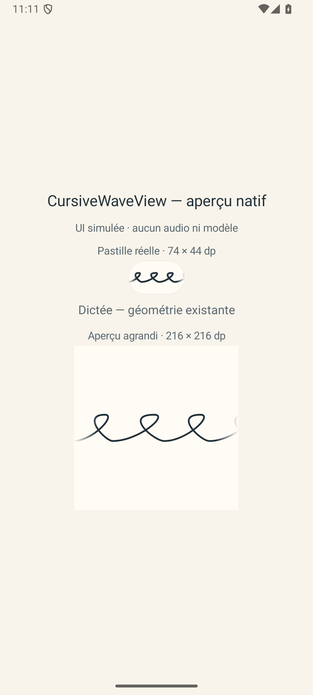

# Pastille Réunion — aperçu Android

La pastille conserve sa forme et ses couleurs. En Réunion, six boucles cursives forment une couronne avec un centre ouvert. Elles tournent pendant l’écoute ; la pause fige l’angle. Les six boucles sont décoratives.

Ces images proviennent de la vraie vue Android dans un scénario d’aperçu sans microphone ni modèle. Astra a inspecté les cinq états et des images successives de la vidéo. Le raccordement aux commandes réelles du service reste à valider.

[Voir la vidéo](cursive-wave-t7d2-run3.mp4) — la rotation apparaît vers 9 secondes, après l’ouverture de l’écran d’aperçu.

## Au repos

## Pendant l’écoute simulée

## Après la pause

## Retour à la dictée

Preuve native : run 3, un test instrumenté réussi en 7,402 secondes. Vidéo SHA-256 : `2d54776bbbdfdc8e4defa08de772c10ac97c8a5de09ede6af0e84760cf113065`. Aucun enregistrement audio n’a été effectué par cette fixture.
